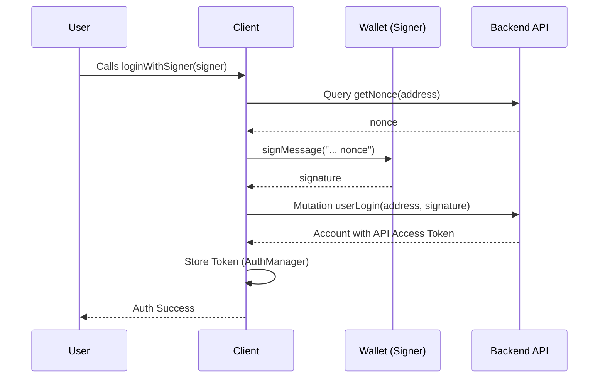

# Authentication

Elacity uses **Sign-In with Ethereum (SIWE)** for secure, decentralized authentication. The `@elacity-js/api` package automates the session management through the `AuthManager`.

## Login Flow

Authentication is typically a two-step process in the browser:
1. The user connects their wallet.
2. The user signs a message (SIWE message) provided by the application.
3. The resulting signature is sent to the backend via the `userLogin` mutation.



### Simplified Login (Recommended)

The SDK provides a `loginWithSigner` helper that automates the entire flow (fetching nonce, signing, and logging in). It requires an object implementing the `AuthSigner` interface (which matches the `ethers.Signer` pattern).

```typescript
// With Ethers.js v6
const provider = new BrowserProvider(window.ethereum);
const signer = await provider.getSigner();

// Automates nonce fetching, message construction, signing, and login
await client.auth.loginWithSigner(signer);

// Optional: Login with a Smart Account
await client.auth.loginWithSigner(signer, '0x...smartAccountAddress');
```

**Parameters:**
- `signer`: `AuthSigner` - Wallet signer (e.g. `ethers.Signer`)
- `sa`: `string` (optional) - Smart Account address to associate with the session.

**Returns:** `Promise<AuthUser>` - The authenticated user session.

#### `login(address, signature, sa?): Promise<AuthUser>`

Performs login with an existing signature.

**Parameters:**
| Parameter | Type | Description |
| :--- | :--- | :--- |
| `address` | `string` | The wallet address. |
| `signature` | `string` | The signature string. |
| `sa` | `string` | (Optional) Smart Account address. |

**Returns:** `Promise<AuthUser>` - The [AuthUser](../../common/Authentication.md#authuser) object.

```typescript
await client.auth.login(address, signature, sa);
```

> [!IMPORTANT]
> The signature message must exactly match: `Approve signature on https://ela.city with nonce <nonce>`. If the user is new, the nonce will be `0`.

## Session Management

Once logged in, the `AuthManager` automatically stores the token and injects it into subsequent GraphQL and HTTP requests.

### Accessing Token Data

```typescript
const user = client.auth.getUser();
const token = client.auth.getToken();
const account = client.auth.getAccount();
```

#### `getUser(): AuthUser | null`
Returns the raw [AuthUser](../../common/Authentication.md#authuser) session from the backend.

#### `getToken(): string | undefined`
Returns only the JWT access token.

#### `getAccount(): AuthAccount | null`
Returns an [AuthAccount](../../common/Authentication.md#authaccount) object containing the active address and owner. Useful for operations where you need to know if the user is using a Smart Account.

### Logging Out

```typescript
client.auth.logout();
```

## Session Persistence

By default, authentication is stored in memory and will be lost on page reload. To persist the session (e.g., in the browser's `localStorage`), you can pass a storage implementation when initializing the client.

### Browser Implementation

The SDK uses a domain-specific storage interface from `@elacity-js/common`. You can easily wrap `localStorage` to work with it:

```typescript
import { ElacityClient } from '@elacity-js/api';
import { AuthTokenStorage, AuthUser } from '@elacity-js/common';

const browserStorage: AuthTokenStorage = {
  load: () => {
    const data = localStorage.getItem('elacity_auth');
    return data ? JSON.parse(data) : null;
  },
  save: (user: AuthUser) => {
    localStorage.setItem('elacity_auth', JSON.stringify(user));
  },
  clear: () => {
    localStorage.removeItem('elacity_auth');
  }
};

const client = new ElacityClient({
  chainId: 20,
  storage: browserStorage
});
```

### Custom Storage (e.g. Backend)

For backend environments, you can implement the same interface from `@elacity-js/common` using Redis, files, or any other database:

```typescript
import { AuthTokenStorage } from '@elacity-js/common';

const redisStorage: AuthTokenStorage = {
  load: async () => { /* fetch from redis */ },
  save: async (user) => { /* save to redis */ },
  clear: async () => { /* remove from redis */ }
};

const client = new ElacityClient({ storage: redisStorage });
```

> [!NOTE]
> The interface expects synchronous methods by default, but you can integrate async logic by handling the hydration manually if needed.

## Automatic Header Injection

All service calls (like `client.nfts.fetchItems`) will automatically include the `Authorization: Bearer <token>` header if the user is authenticated. You can also manually provide a token for a single request:

```typescript
const items = await client.nfts.fetchItems({}, { token: 'external-jwt' });
```
