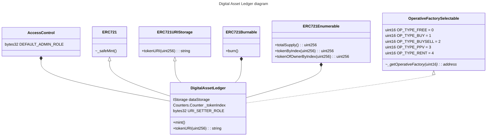
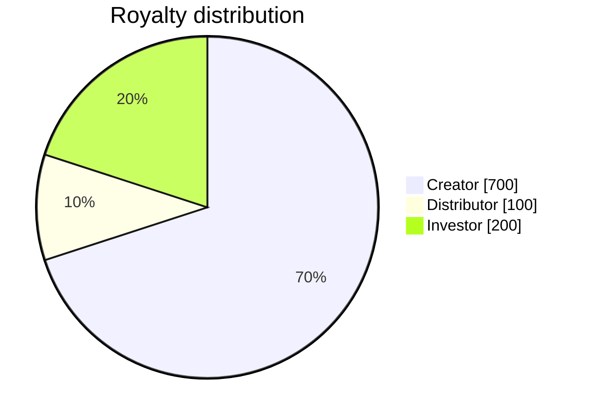
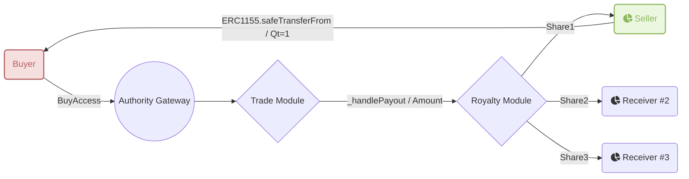

### Abstract
This EIP proposes a set of smart contracts to standardize the handling of Intellectual Property as non-fungible tokens (NFTs), while providing a comprehensive solution for enforcing royalty payments, distribution among multiple recipients, and Digital Rights Management (DRM) protected content. 

Our proposed set of smart contracts will enable a secure, decentralized, and efficient ecosystem for the issuance, transfer, and monetization of digital assets, allowing users to access and manage their digital assets with ease.

### Motivation
NFTs are normally governed by the ERC721 or ERC1155 standards. Existing solutions such as EIP-2981, EIP-4910, and EIP-5553 support royalties but do not provide a comprehensive solution for both the enforcement and distribution when multiple recipients are involved.

**ERC2981**: A standardized way to retrieve royalty payment information for non-fungible tokens (NFTs) to enable universal support for royalty payments across all NFT marketplaces and ecosystem participants.

**EIP4910**: Extends EIP-721 to include royalty account management, balance & payment management, and trading capabilities to link NFTs with royalties and prevent central authorities from manipulating payments. Uses OpenZeppelin Smart Contract Toolbox to establish royalty trees connecting parent NFTs to children, allowing for recursive trading.

**ERC5553**: Presents a generic way to represent IP on the blockchain, with a royalty representation mechanism and linked metadata. It can be used for many types of IP, such as music, videos, books, and images, and remains generic to accommodate evolving ecosystems. It lets participants view IP's on-chain representation, find its metadata, and discover its royalty structure, allowing for registration, licensing, and future payout mechanisms.

Our new set of smart contracts seeks to fill this gap and lay the groundwork for a DRM-compatible NFT contract, taking into account the definition of digital assets in a distributed platform, the royalty structure, and licensing via cryptographic methods.


These smart contracts aim to
* Provide a registry of IP/media, with its metadata and CEL/MCO Contract 
* Provide a registry of the IP/media stakeholders (parties, actors, beneficiaries)
* Provide tradable and transferable NFTs that comply with the restrictions and enforcement defined in the CEL/MCO Contract
* Enforce royalty payments and distributions as defined in the CEL/MCO Contract
* Facilitate different user scenarios according to what is supported in the CEL/MCO Contract
* Provide license keys to unlock IP/media for legitimate users via DRM-compatible media players (DashJS)

### Specification

The keywords “MUST”, “MUST NOT”, “REQUIRED”, “SHALL”, “SHALL NOT”, “SHOULD”, “SHOULD NOT”, “RECOMMENDED”, “MAY”, and “OPTIONAL” in this document are to be interpreted as described in RFC 2119.

#### Outline

This proposal introduces several new concepts as extensions to the EIP-1155 standard that warrant explanation:

* CEL
* REL
* MCO
* SCM
* Digital Asset Ledger
> 1 token in this smart contract represents the IP and contains static metadata, including SCM data, in JSON format and stored on IPFS. It contains the data that will not change over time.
* Operative Tokens
> This part of the structure is responsible for the execution of the SCM terms. It holds all the copies represented by ERC721 like tokens (ACCESS_TOKEN type) and other entitlements, such as royalty rights, which are represented as shares (ROYALTY_SHARE type).
* Token Type
> There are currently four different types of tokens, each of which corresponds to a different use case: Buy & Play, Buy, Play & Sell, Rent & Play, and Pay-Per-View.
* Access Token
> An ERC721/ERC1155 like token that is responsible for the execution of SCM terms.
* Royalty Shares
> A token that represents the right to collect a share of the royalties from the sale or transfer of the NFT.
* Distribution Rights
> A token representing the right to trade and/or transfer an NFT / Access Token.
* Authority Gateway
> A smart contract with modules responsible for enforcing payments, regulating access to the content, managing all forms of trades and transfers, and issuing licenses. It handles the approval/authorization of all trades and transfers.


### Rationale
Our proposed set of smart contracts provides a comprehensive solution for issuing, transferring, and monetizing digital assets, allowing users to access and manage their digital assets with ease. 

The contracts are designed to enable a secure, decentralized, and efficient ecosystem for the protection and enforcement of the rights of stakeholders.


### Smart contracts design

Following is an overview of the structure of the smart contracts and how they interact with each other:


This section provides a detailed description of each component of the smart contract structure and explains how they interact with each other, focusing on understanding the flow in which they are involved.

#### Digital Asset Ledger (ERC721)

This part of the structure represents the IP and contains static metadata and SCM data in JSON format, stored on IPFS. This data will remain static and not change over time.

This contract is a `ERC721`-based; 1 token represents 1 digital asset. **It aims to be a registry of all digital assets**. Below is the metadata schema for this token:

```json
{
  "title": "Ledger Token Metadata",
  "description": "Ledger Token Metadata schema",
  "type": "object",
  "required": ["name", "description", "image", "kid", "iscc"],
  "properties": {
    "kid": {
      "type": "string",
      "description": "Content identifier, 16-bytes hex string"
    },
    "iscc": {
      "type": "string",
      "description": "ISCC code identification"
    },
    "name": {
      "type": "string",
      "description": "Token name"
    },
    "description": {
      "type": "string",
      "description": "Token description"
    },
    "image": {
      "type": "string",
      "description": "ipfs link to image"
    },
    "media": {
      "type": "object",
      "description": "Details about the media file",
      "required": ["contentType", "uri"],
      "properties": {
        "uri": {
          "type": "string",
          "description": "ipfs link to media file, basically to MDP file for streamed video/audio"
        },
        "contentType": {
          "type": "string",
          "description": "mime-type or generic type of the content"
        },
        "protectionType": {
          "type": "array",
          "description": "Type of protection, e.g. clearkey, cenc:web3-drm, etc..."
        },
        "object": {
          "type": "string",
          "description": "ipfs link to the contract object"
        }
      }
    },
    "properties": {
      "type": "object",
      "description": "Token properties",
      "required": ["chainId", "ledger", "authority", "publisher"],
      "properties": {
        "chainId": {
          "type": "number",
          "description": "Blockchain network chain id"
        },     
        "ledger": {
          "type": "string",
          "description": "Digital Ledge address"
        },
        "authority": {
          "type": "string",
          "description": "Authority address"
        },        
        "publisher": {
          "type": "string",
          "description": "Address of the publisher, from where the token was minted"
        },
        "contract": {
          "type": "string",
          "description": "ipfs link to the contract object, only for protected content"
        },
        "labelType": {
          "type": "string",
          "description": "Label type that defined ands and have authority on distribution and license usage"
        },
        "distribution": {
          "type": "string",
          "description": "Access method, e.g. streaming, download, rent, ppv, etc..."
        }
      }
    },
    "attributes": {
      "type": "array",
      "description": "Array of attributes"
    }
  }
}
```

It's the main entry point for creating new assets. The `mint` function, apart from creating the digital asset unique token, will also create the [Operative contract](#operative-contracts-group) relative to how the media will be distributed (Free, Buy-Play, Buy-Play-Sell,...).

To do so, this contract abstracts `OperativeFactorySelectable`, which enables the ability to select a factory used to generate the operative contract relative to the `opType` requested during the creation.

```solidity
abstract contract OperativeFactorySelectable {
    uint16 constant OP_TYPE_FREE = 0;
    uint16 constant OP_TYPE_BUY = 1;
    uint16 constant OP_TYPE_BUYSELL = 2;
    uint16 constant OP_TYPE_PPV = 3; // not yet implemented
    uint16 constant OP_TYPE_RENT = 4; // not yet implemented

    /**
     * @dev Returns the address of the operative factory for the given type.
     *
     * @param _opType The type of the operative factory.
     * @return The address of the operative factory.
     */
    function _getOperativeFactory(uint16 _opType)
        internal
        view
        virtual
        returns (address);
}
```

The `mint` function uses `_getOperativeFactory` internally and will ensure that the Operative contract is created within the ecosystem and can interact with the other smart contracts.

Ownership of any token in this contract is meaningless; owning a token from this contract gives no extra benefits. The minter is the initial owner of the token.

<details><summary>See Diagram</summary>
<p>



</p>
</details>

#### Operative contracts group

This is a set of contracts intended to manage access, rights, and how royalties are distributed. 
It's the part of the structure in charge of executing the terms of the CEL/MCO.

There are four different types of contracts, each of which corresponds to a different use case:
1. Buy & Play
1. Buy, Play & Sell
1. Rent & Play - *(Not yet implemented)*
1. Pay-Per-View (PPV) - *(Not yet implemented)*

The list above is a work in progress; other use cases could come later.

Each of these contracts is responsible for a single media as defined in the Digital Asset Ledger, and it holds all the copies represented by an `ACCESS_TOKEN` token type with a totalSupply equal to the number of copies. 

Other entitlements, such as royalty rights, are represented as shares, which are ERC20-like tokens (`ROYALTY_SHARE` type). 

For convenience (not mandatory), these token types are set to a fixed uint256 variable and set as constant to have a uniform set of token Id types for each contract type. 

For example:
- `ACCESS_TOKEN` is `id=1`
- `ROYALTY_SHARES` is `id=2`
- `DISTRIBUTION_RIGHT` is `id=3`

*Additional token types can be added as needed in the future.*

Each use case is represented by 1 type of contract. 1 IP/media in the Digital Asset Ledger will be bound to 1 Operative contract, which enforces and executes all the terms of the SCM. 

Each type of contract has its own flow in regards to what is restricted, what is authorized, what's happening during transfer or after a trade, etc... 

1 contract factory is set to create this contract. Each factory implements an interface `IOperativeFactory` defined as follows:


```solidity
interface IOperativeFactory {
    /**
     * @dev create the new Operative contract in charge of handling all Operative Tokens
     * related to a given Digital Asset. Generally, created contract is a ERC1155
     *
     * @param creator Address of the creator of the contract
     * @param data Data to be used to initialize the contract, we use bytes to provide more
     * flexibility when creating the Operative contract itself
     *
     * @return Address of the created contract
     */
    function createFromBytes(address creator, bytes memory data)
        external
        returns (address);

    /**
     * @dev check whether a contract has been created through the factory
     *
     * @param opContract Address of the contract we want to check
     */
    function exists(address opContract) external view returns (bool);
}
```

For unrestricted media, no Operative contract will be created.

Even though each of the Operative contracts has its own flow, they all implement the same interface, `IOperative` defined below:

```solidity
interface IOperative is IERC1155, IERC2981Enhanced {
    struct AccessLevel {
        bool haveAccess;
        uint256 entitlement;
    }

    /**
     * @dev Represents the identifier of the digital asset over the ecosystem
     * its value complies with RFC-4122 specification and is 128-bits long as a requirement of
     * https://dashif-documents.azurewebsites.net/Guidelines-Security/master/Guidelines-Security.html#content-key
     *
     * See also https://www.ietf.org/rfc/rfc4122.txt
     */
    function contentId() external view returns (bytes16);

    /**
     * @dev Constant that represents the type of digital asset.
     */
    function OP_TYPE() external view returns (uint16);

    /**
     * @dev Constant that represents the access token id.
     */
    function ACCESS_TOKEN() external view returns (uint256);

    /**
     * @dev Constant that represents the royalty share token id.
     */
    function ROYALTY_SHARE() external view returns (uint256);

    /**
     * @dev Constant that represents the distribution right token id.
     */
    function DISTRIBUTION_RIGHT() external view returns (uint256);

    /**
     * @dev Returns the access level of a given account to the digital asset.
     *
     * @param account The address of the account to check.
     */
    function checkAccess(address account)
        external
        view
        returns (AccessLevel[] memory);
}
``` 

From these contracts, we can retrieve the access an account has over a digital asset by calling `checkAccess(address): (bool hasAccess, uint256 entitlement)[]`. 

This interface also inherits the interface `IERC2981Enhanced`, a variant of [`ERC2981`](https://eips.ethereum.org/EIPS/eip-2981), different from it by the return type of `royaltyInfo`. 


```solidity
interface IERC2981Enhanced is IERC165 {
    struct RoyaltyInfo {
        address receiver;
        uint256 amount;
    }

    function royaltyInfo(uint256 _salePrice)
        external
        view
        returns (RoyaltyInfo[] memory);
}
```

With this enhanced version, it is now possible to **support multiple receivers of royalty payments, with each receiver being assigned a different portion**. The royalty shares are represented by the number of tokens a user owns in the Operative contract, and this value can be obtained using the `.balanceOf(address, ROYALTY_SHARE)`. The total supply of this token type is `1000`, equivalent to 100%. We chose 1000 here to allow 1 decimal point when setting the royalty portion.

For example:



**IMPORTANT** This contract is not intended to process any royalty payments or access transfers. Instead, it is responsible for controlling the distribution of the operative parts over the blockchain, i.e., "who owns which quantity of what."

See the big picture of that structure through the diagram below:


<details><summary>See Diagram</summary>
<p>


<br>
A: Abstract contract<br>
C: Contract (the only object that will be deployed and output an address)<br>
I: Interface<br>
</p>

</details>

For each token type, below are metadata schema

##### `ACCESS_TOKEN`

This token represent the permission to access a content

```json
{
  "title": "Access Token",
  "description": "Access Token specification",
  "type": "object",
  "required": ["type", "description", "contract"],
  "properties": {
    "type": {
      "type": "string",
      "description": "Type of the contract: AccessToken"
    },
    "description": {
      "type": "string",
      "description": "Description of the token"
    },
    "image": {
      "type": "string",
      "description": "ipfs link to image/thumbnail"
    },
    "contract": {
      "type": "object",
      "description": "Define SCM specification"
    }
  }
}
```

##### `ROYALTY_SHARE`

This token represents a the split for royalty distribution, the total supply is set to `1000` which is equivalent to 100%

```json
{
  "title": "Royalty Share",
  "description": "Token specification",
  "type": "object",
  "required": ["type", "description", "contract"],
  "properties": {
    "type": {
      "type": "string",
      "description": "Type of the contract: RoyaltyShare"
    },
    "description": {
      "type": "string",
      "description": "Description of the token"
    },
    "image": {
      "type": "string",
      "description": "ipfs link to image/thumbnail"
    },
    "contract": {
      "type": "object",
      "description": "Define SCM specification"
    }
  }
}
```

##### `DISTRIBUTION_RIGHT`

this token represents the right to sell or transfer an `ACCESS_TOKEN`. When relevant, only holder of this token can put an `ACCESS_TOKEN` on sale

```json
{
  "title": "Distribution Right",
  "description": "Token specification",
  "type": "object",
  "required": ["type", "description", "contract"],
  "properties": {
    "type": {
      "type": "string",
      "description": "Type of the contract: DistributionRight"
    },
    "description": {
      "type": "string",
      "description": "Description of the token"
    },
    "image": {
      "type": "string",
      "description": "ipfs link to image/thumbnail"
    },
    "contract": {
      "type": "object",
      "description": "Define SCM specification"
    }
  }
}
```


#### Authority Gateway 

This part of the structure is responsible for enforcing payments and regulating access to the content:
* playing the role of a native marketplace
* managing all forms of trades and transfers
* issuing licenses

What can be traded are ACCESS_TOKEN, ROYALTY_SHARE, or other future potential rights an account can own, like DISTRIBUTION_RIGHTS. 

This contract handles the approval/authorization of all trades and transfers. 

Each feature belonging to this contract is managed by a dedicated, which implements the flows for each operation type. 

The **Royalty module** is responsible for royalties payment processing based on `ROYALTY_SHARE` holdings. The role of this module is to provide utilities 
 (in occurrence with `TradeModule`) to process any form of payment according to how funds must be distributed during a trade operation. The main functions are:
- `_payRoyalties(IERC2981Enhanced.RoyaltyInfo[] dispatch, address payToken)`: process the payment according to the dispatch defined from the operative contract that implements `IERC2981Enhanced` interface
- `_payAmount(address to, uint256 amount, address payToken)`: a lower-level function that executes the payment, an event `PaymentLog` is emitted on successful operation.

These methods are internal and are used by `TradeModule`. None of them are publicly executable.


**Trade and transfer module** responsible for all trades and transfers of Operative Tokens. It contains:
- `sellAccess(address ledger, uint256 tokenId, uint256 qt, uint256 price, address payToken)`: this method puts an asset on sale. Note that the asset here is identified by its location in a ledger contract context
- `sellAccessOnBehalf(address seller, address ledger, uint256 tokenId, uint256 qt, uint256 price, address payToken)`: this method puts an asset on sale on behalf of a user through a non-EOA address. Note that the asset here is identified by its location in a ledger contract context, and the executor is an approved contract in the ecosystem. The final state should be the same as `sellAccess` 
- `buyAccess(address seller, address ledger, uint256 tokenId, uint256 qt, unit256 price) payable | buyAccess(address seller, address ledger, uint256 tokenId, uint256 qt, unit256 price, address payToken)`: this is the entry point for buying an `ACCESS_TOKEN`, the asset is identified by its location in the ledger. During this operation, two types of transfers are expected: `ACCESS_TOKEN` transfer `Seller -> Buyer` and payment `Buyer -> Stakeholders`.
- `withdrawListing(address op, uint256 tokenId, uint256 qt)`: Allows a seller to withdraw token from listing. the quantity should be less than or equal to the quantity in the listing
- `listings(address op, uint256 tokenId, address seller)`: retrieves sales information set by a specific seller to an asset identified within the operative context.
- `sellersOf(address op, uint256 tokenId)`: retrieves a list of addresses of sellers who have currently listed a specific asset, identified within the operative context.

For the most simple use case, the flowchart is as follows:



This module has other internal methods that perform these actions and enforce royalties payout. For interoperability, we defined the interface `ITradable`:

```solidity
interface ITradable {
    /**
     * @dev Put a digital asset on sale, the asset here is defined by its location in the ledger context
     *
     * @param ledger The address of the ledger
     * @param tokenId The id of the token
     * @param _quantity The quantity of the token
     * @param _pricePerToken The price per token
     * @param _payToken The address of the token to pay with
     */
    function sellAccess(
        address ledger,
        uint256 tokenId,
        uint256 _quantity,
        uint256 _pricePerToken,
        address _payToken
    ) external;

    /**
     * @dev Put a digital asset on sale on behalf of a user through a non-EOA address, the asset here is defined by its location in the ledger context
     * the exection could require ERC1155 approval from the seller to succeed
     *
     * @param seller The address of the seller
     * @param ledger The address of the ledger
     * @param tokenId The id of the token
     * @param _quantity The quantity of the token
     * @param _pricePerToken The price per token
     * @param _payToken The address of the token to pay with
     */
    function sellAccessOnBehalf(
        address seller,
        address ledger,
        uint256 tokenId,
        uint256 _quantity,
        uint256 _pricePerToken,
        address _payToken
    ) external;

    /**
     * @dev Buy a digital asset, the asset here is defined by its location in the ledger context.
     * The amount that should be passed into `msg.value` should fulfill the operation and should not be less than _quantity * _pricePerToken
     *
     * @notice This moethod requires ERC1155 approval from the buyer in prior to the execution
     *
     * @param seller The address of the seller
     * @param ledger The address of the ledger
     * @param tokenId The id of the token
     * @param _quantity The quantity of the token
     * @param _pricePerToken The price per token
     */
    function buyAccess(
        address seller,
        address ledger,
        uint256 tokenId,
        uint256 _quantity,
        uint256 _pricePerToken
    ) external payable;

    /**
     * @dev Buy a digital asset, the asset here is defined by its location in the ledger context.
     * Payment token here should comply with ERC20 standard
     * The amount that should be passed into `msg.value` should fulfill the operation and should not be less than _quantity * _pricePerToken
     *
     * @notice This moethod requires ERC1155 approval from the buyer in prior to the execution
     *
     * @param seller The address of the seller
     * @param ledger The address of the ledger
     * @param tokenId The id of the token
     * @param _quantity The quantity of the token
     * @param _pricePerToken The price per token
     * @param _payToken The address of the token to pay with, should be ERC20 compliant
     */
    function buyAccess(
        address seller,
        address ledger,
        uint256 tokenId,
        uint256 _quantity,
        uint256 _pricePerToken,
        address _payToken
    ) external;

    /**
     * @dev Allows a seller to withdraw token from listing. the quantity should be less than or
     * equal to the quantity in the listing
     *
     * @param op The address of the target operative contract
     * @param tokenId The id of the token
     * @param quantity The quantity to withdraw
     */
    function withdrawListing(
        address op,
        uint256 tokenId,
        uint256 quantity
    ) external;

    /**
     * @dev Get the listing details of a digital asset, the asset here is defined directly
     * from its location within the Operative contract
     *
     * @param op The address of the operative
     * @param tokenId The id of the token
     * @param seller The address of the seller
     * @return The quantity, price per token and the payment token address
     */
    function listings(
        address op,
        uint256 tokenId,
        address seller
    )
        external
        view
        returns (
            uint256,
            uint256,
            address
        );

    /**
     * @dev Get the sellers of a digital asset, the asset here is defined within the operative contract context
     *
     * @param op The address of the operative
     * @param tokenId The id of the token
     * @return The sellers of the token
     */
    function sellersOf(address op, uint256 tokenId)
        external
        view
        returns (address[] memory);
}
```


The **License module** is responsible for license management, including keys registration, and license acquisition. We adopted a simple flow in the current protocol version that fulfill a [clearkey](https://www.w3.org/TR/encrypted-media/#clear-key) decryption flow and potentially another new DRM system, we format license response as defined later below.

Below are the functions that this module implements:
- `registerIPWithKey(address ledger, bytes16 contentId, bytes16 key)`: Register new IP in the system using a full set of keys (public, private). The keys here are both [RFC 4122](https://www.ietf.org/rfc/rfc4122.txt) compliant. In this context, both keys should be generated off-chain, and they both are used to encrypt the media content as stated [in this assessment](https://www.bento4.com/developers/dash/encryption_and_drm/#encrypting-as-a-separate-step)
- `verifyLicenseRequest(LicenseRequest lr, bytes memory sig)`: A public method to verify the authenticity of a license request. It is used by `acquireLicense` but could be used externally for verification purposes. This flow is a verification step ahead of the [ECDSA Signature Verification](https://medium.com/@VitalikButerin/exploring-elliptic-curve-pairings-c73c1864e627) where the request input is [EIP-712](https://eips.ethereum.org/EIPS/eip-712) compliant. It returns an address that should be equal to the signer's address. 
- `acquireLicense(bytes calldata req)`: will process a license request from a blockchain perspective. Returned data could be different from what a media player expects, but it SHOULD contain all information needed to format it correctly. This method returns the `License` object as defined below. For security reason, we encrypt the license reponse to prevent sending sensitive data through network following the flow defined in [this cryptographic protocol](./5--Cryptographic-Protocol-(v1.0).md)

###### License definition
```solidity
  struct License {
    /// @notice the address of the issuer should be the contract that implements this module
    address issuer;
    /// @notice the address the license is issued for
    address toAddress;
    /// @notice Identity of the media content
    IPEntity entity;
    /// @notice plain decryption key
    /// @dev the nature of this key could change over time as we can find a better
    /// way handle the Content Decryption Module
    bytes16 key;
  }
```

<details><summary>See Diagram</summary>
<p>

[![Authority contract][image4]][hyperlink4]

[hyperlink4]: ./assets/diagram/AuthorityGateway.svg
[image4]: ./assets/diagram/AuthorityGateway.svg
</p>

</details>

