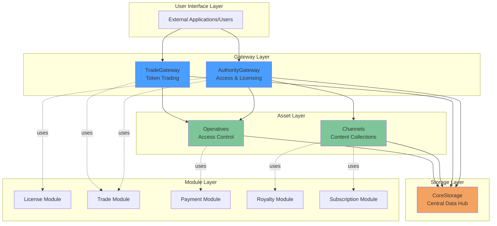
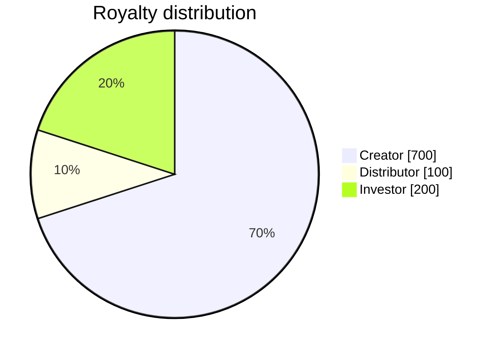
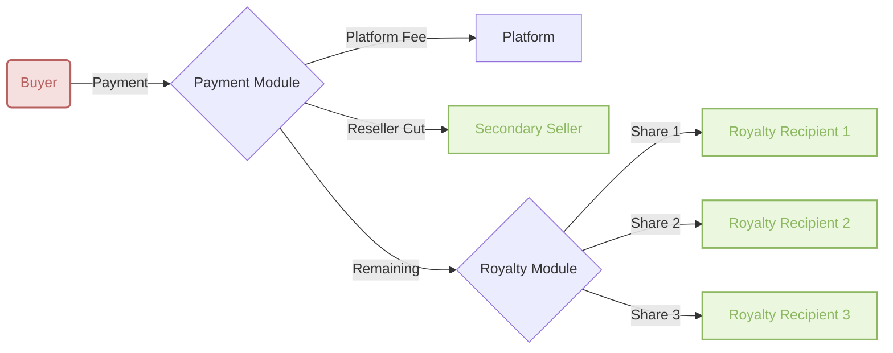
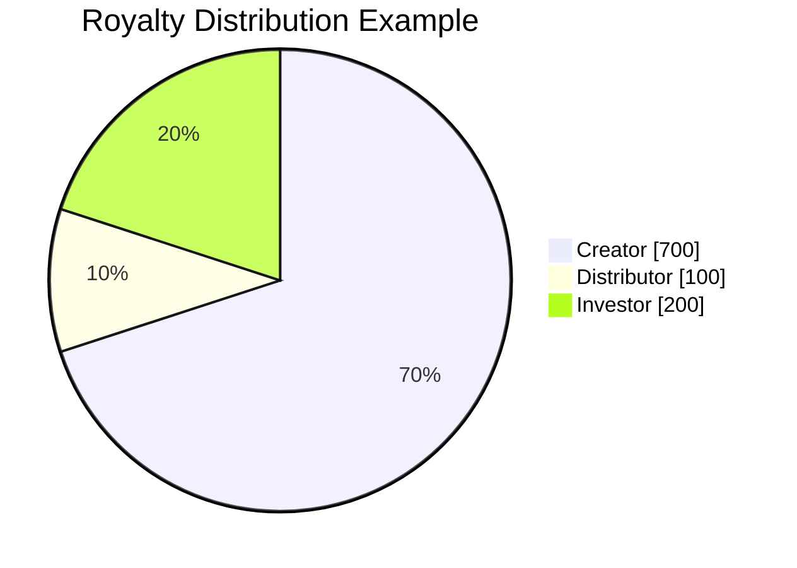
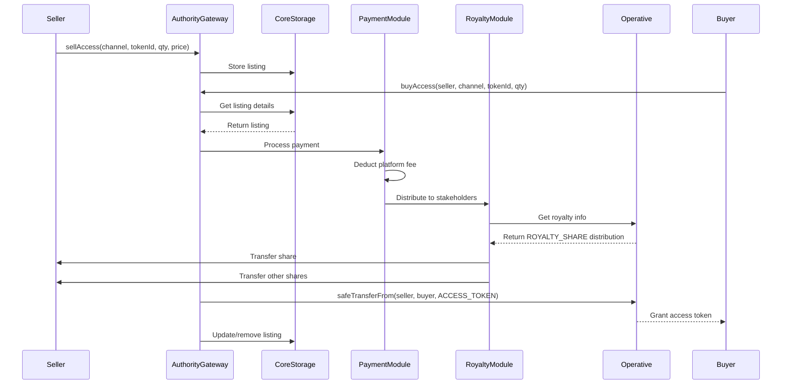

### Abstract

This proposal introduces a comprehensive smart contract ecosystem for managing digital rights, access control, and marketplace operations for digital media assets on the blockchain. Built on ERC-1155 standards with enhanced royalty distribution inspired by EIP-2981, EIP-4910, and EIP-5553, the system provides:

- **Advanced Digital Rights Management (DRM)** with cryptographic licensing
- **Multi-stakeholder royalty distribution** supporting complex revenue sharing
- **Flexible access models** including permanent ownership, resale rights, and subscriptions
- **Dual marketplace system** via AuthorityGateway (access tokens) and TradeGateway (asset trading)
- **Modular architecture** with specialized modules for licensing, payments, royalties, and subscriptions
- **Centralized storage** through CoreStorage for ecosystem-wide data management

Our proposed ecosystem enables creators to tokenize digital assets with sophisticated access controls, subscription models, and cryptographic licensing mechanisms, providing a secure, decentralized, and efficient platform for managing digital media rights.

### Motivation
NFTs are normally governed by the ERC721 or ERC1155 standards. Existing solutions such as EIP-2981, EIP-4910, and EIP-5553 support royalties but do not provide a comprehensive solution for both the enforcement and distribution when multiple recipients are involved.

**ERC2981**: A standardized way to retrieve royalty payment information for non-fungible tokens (NFTs) to enable universal support for royalty payments across all NFT marketplaces and ecosystem participants.

**EIP4910**: Extends EIP-721 to include royalty account management, balance & payment management, and trading capabilities to link NFTs with royalties and prevent central authorities from manipulating payments. Uses OpenZeppelin Smart Contract Toolbox to establish royalty trees connecting parent NFTs to children, allowing for recursive trading.

**ERC5553**: Presents a generic way to represent IP on the blockchain, with a royalty representation mechanism and linked metadata. It can be used for many types of IP, such as music, videos, books, and images, and remains generic to accommodate evolving ecosystems. It lets participants view IP's on-chain representation, find its metadata, and discover its royalty structure, allowing for registration, licensing, and future payout mechanisms.

Our new set of smart contracts seeks to fill this gap and lay the groundwork for a DRM-compatible NFT contract, taking into account the definition of digital assets in a distributed platform, the royalty structure, and licensing via cryptographic methods.


The smart contract ecosystem aims to:
* Provide a hierarchical channel system for organizing digital content (Channels and Multi-Channels)
* Manage digital asset registration with unique content IDs and metadata
* Provide registry of IP stakeholders (creators, distributors, royalty beneficiaries)
* Enable tradable and transferable access tokens that comply with defined access rules
* Enforce multi-stakeholder royalty payments and distributions
* Support flexible access models: permanent ownership, resale rights, and subscriptions
* Provide cryptographic license keys to unlock DRM-protected media for legitimate users
* Separate access token marketplace (AuthorityGateway) from general asset trading (TradeGateway)

### Specification

The keywords “MUST”, “MUST NOT”, “REQUIRED”, “SHALL”, “SHALL NOT”, “SHOULD”, “SHOULD NOT”, “RECOMMENDED”, “MAY”, and “OPTIONAL” in this document are to be interpreted as described in RFC 2119.

#### Outline

This proposal introduces several key concepts as extensions to the ERC-1155 standard:

##### **Core Architecture Layers**
* **Gateway Layer**: Entry points for user interactions
  * **AuthorityGateway**: Access control, licensing, and access token marketplace
  * **TradeGateway**: General asset trading (royalty shares, distribution rights)
* **Asset Layer**: Digital content management
  * **Channels**: ERC-1155 containers for digital assets (StandardChannel, MultiChannel)
  * **Operatives**: Access control contracts governing individual assets
* **Module Layer**: Reusable specialized functionality
  * **LicenseModule**: Cryptographic license generation (ECDH/ECDSA)
  * **TradeModule**: Marketplace logic (listings, offers)
  * **PaymentModule**: Native and ERC-20 token payments
  * **RoyaltyModule**: ERC-2981 enhanced multi-recipient distribution
  * **SubscriptionModule**: Time-based access management
* **Storage Layer**: Centralized data registry
  * **CoreStorage**: Factory tracking, IP registration, marketplace data

##### **Token Types in Operative Contracts**
* **ACCESS_TOKEN (ID: 1)**
  > Grants permanent or temporary access rights to digital content. Required for license acquisition.
* **RESALE_RIGHT (ID: 2)**
  > Enables reselling of access tokens in secondary markets (OperativeBuyableSellable only).
* **DISTRIBUTION_RIGHT (ID: 3)**
  > Represents creator's distribution rights and controls initial sales authorization.
* **ROYALTY_SHARE (ID: 2 in some contexts)**
  > Represents proportional ownership stake in royalty distribution (total supply: 1000 = 100%).

##### **Operative Contract Types**
* **OperativeBuyable (Type 1)**
  > "Buy once, play forever" model with distribution rights only for creators.
* **OperativeBuyableSellable (Type 2)**
  > Full resale capability with automatic distribution rights for access token holders.


### Rationale
Our proposed set of smart contracts provides a comprehensive solution for issuing, transferring, and monetizing digital assets, allowing users to access and manage their digital assets with ease. 

The contracts are designed to enable a secure, decentralized, and efficient ecosystem for the protection and enforcement of the rights of stakeholders.


### Smart Contracts Design

Following is an overview of the architecture of the smart contracts and how they interact with each other:


The ecosystem is structured in distinct layers:



This section provides a detailed description of each component of the smart contract ecosystem and explains how they interact with each other.

#### Channels (Digital Asset Containers)

Channels are ERC-1155 contracts that serve as containers for digital content collections. They replace the previous Digital Asset Ledger concept with a more flexible, hierarchical system.

##### **Channel Types**

**StandardChannel** - Basic content containers
- **Variants**:
  - `DigitalAssetPublic`: Anyone can mint content
  - `DigitalAssetPrivate`: Only channel owner can mint
- **Features**:
  - Individual asset tokenization with unique token IDs
  - Subscription-based access models
  - Royalty share distribution
  - Automatic Operative contract deployment per asset

**MultiChannel** - Channel aggregators
- Wrapper contracts bundling multiple StandardChannels
- Unified subscription access across all wrapped channels
- Use cases: content networks, premium bundles, creator collaborations

##### **Asset Creation Flow**

1. Creator calls `createAsset(uri, opType, config)` on a Channel
2. Channel generates deterministic `tokenId` from URI hash
3. Channel mints NFT to creator's address
4. Channel requests appropriate Operative factory from CoreStorage
5. Operative contract is deployed and initialized
6. Content ID (KID) is registered in CoreStorage IPTracker
7. Operative address is bound to channel/tokenId pair

##### **Metadata Schema**

Channels use the following metadata structure (stored on IPFS):

```json
{
  "title": "Channel Token Metadata",
  "type": "object",
  "required": ["name", "description", "image", "kid", "iscc"],
  "properties": {
    "kid": {
      "type": "string",
      "description": "Content identifier, RFC-4122 compliant 128-bit hex"
    },
    "iscc": {
      "type": "string",
      "description": "International Standard Content Code"
    },
    "name": {"type": "string", "description": "Asset name"},
    "description": {"type": "string", "description": "Asset description"},
    "image": {"type": "string", "description": "IPFS link to thumbnail"},
    "media": {
      "type": "object",
      "required": ["contentType", "uri"],
      "properties": {
        "uri": {"type": "string", "description": "IPFS link to media (MPD manifest for streaming)"},
        "contentType": {"type": "string", "description": "MIME type"},
        "protectionType": {"type": "array", "description": "DRM types: clearkey, cenc:web3-drm"}
      }
    },
    "properties": {
      "type": "object",
      "required": ["chainId", "channel", "authority"],
      "properties": {
        "chainId": {"type": "number"},
        "channel": {"type": "string", "description": "Channel contract address"},
        "authority": {"type": "string", "description": "AuthorityGateway address"},
        "operative": {"type": "string", "description": "Operative contract address"},
        "publisher": {"type": "string", "description": "Creator address"},
        "distribution": {"type": "string", "description": "Access method: streaming, download, subscription"}
      }
    }
  }
}
```

##### **Key Differences from Digital Asset Ledger**

| Aspect | Previous (Digital Asset Ledger) | Current (Channels) |
|--------|-------------------------------|-------------------|
| **Standard** | ERC-721 | ERC-1155 |
| **Structure** | Single registry contract | Multiple channel instances |
| **Organization** | Flat asset list | Hierarchical channels + multi-channels |
| **Subscriptions** | Not supported | Native subscription system |
| **Ownership** | Meaningless | Enables creator economies |

Ownership of channel tokens (NFTs) now represents actual asset ownership and may grant benefits such as royalty shares or distribution rights, depending on the channel configuration.

#### Operative contracts group

This is a set of contracts intended to manage access, rights, and how royalties are distributed. 
It's the part of the structure in charge of executing the terms of the CEL/MCO.

There are four different types of contracts, each of which corresponds to a different use case:
1. Buy & Play
1. Buy, Play & Sell
1. Rent & Play - *(Not yet implemented)*
1. Pay-Per-View (PPV) - *(Not yet implemented)*

The list above is a work in progress; other use cases could come later.

Each of these contracts is responsible for a single media as defined in the Digital Asset Ledger, and it holds all the copies represented by an `ACCESS_TOKEN` token type with a totalSupply equal to the number of copies. 

Other entitlements, such as royalty rights, are represented as shares, which are ERC20-like tokens (`ROYALTY_SHARE` type). 

For convenience (not mandatory), these token types are set to a fixed uint256 variable and set as constant to have a uniform set of token Id types for each contract type. 

For example:
- `ACCESS_TOKEN` is `id=1`
- `ROYALTY_SHARES` is `id=2`
- `DISTRIBUTION_RIGHT` is `id=3`

*Additional token types can be added as needed in the future.*

Each use case is represented by 1 type of contract. 1 IP/media in the Digital Asset Ledger will be bound to 1 Operative contract, which enforces and executes all the terms of the SCM. 

Each type of contract has its own flow in regards to what is restricted, what is authorized, what's happening during transfer or after a trade, etc... 

1 contract factory is set to create this contract. Each factory implements an interface `IOperativeFactory` defined as follows:


```solidity
interface IOperativeFactory {
    /**
     * @dev create the new Operative contract in charge of handling all Operative Tokens
     * related to a given Digital Asset. Generally, created contract is a ERC1155
     *
     * @param creator Address of the creator of the contract
     * @param data Data to be used to initialize the contract, we use bytes to provide more
     * flexibility when creating the Operative contract itself
     *
     * @return Address of the created contract
     */
    function createFromBytes(address creator, bytes memory data)
        external
        returns (address);

    /**
     * @dev check whether a contract has been created through the factory
     *
     * @param opContract Address of the contract we want to check
     */
    function exists(address opContract) external view returns (bool);
}
```

For unrestricted media, no Operative contract will be created.

Even though each of the Operative contracts has its own flow, they all implement the same interface, `IOperative` defined below:

```solidity
interface IOperative is IERC1155, IERC2981Enhanced {
    struct AccessLevel {
        bool haveAccess;
        uint256 entitlement;
    }

    /**
     * @dev Represents the identifier of the digital asset over the ecosystem
     * its value complies with RFC-4122 specification and is 128-bits long as a requirement of
     * https://dashif-documents.azurewebsites.net/Guidelines-Security/master/Guidelines-Security.html#content-key
     *
     * See also https://www.ietf.org/rfc/rfc4122.txt
     */
    function contentId() external view returns (bytes16);

    /**
     * @dev Constant that represents the type of digital asset.
     */
    function OP_TYPE() external view returns (uint16);

    /**
     * @dev Constant that represents the access token id.
     */
    function ACCESS_TOKEN() external view returns (uint256);

    /**
     * @dev Constant that represents the royalty share token id.
     */
    function ROYALTY_SHARE() external view returns (uint256);

    /**
     * @dev Constant that represents the distribution right token id.
     */
    function DISTRIBUTION_RIGHT() external view returns (uint256);

    /**
     * @dev Returns the access level of a given account to the digital asset.
     *
     * @param account The address of the account to check.
     */
    function checkAccess(address account)
        external
        view
        returns (AccessLevel[] memory);
}
``` 

From these contracts, we can retrieve the access an account has over a digital asset by calling `checkAccess(address): (bool hasAccess, uint256 entitlement)[]`. 

This interface also inherits the interface `IERC2981Enhanced`, a variant of [`ERC2981`](https://eips.ethereum.org/EIPS/eip-2981), different from it by the return type of `royaltyInfo`. 


```solidity
interface IERC2981Enhanced is IERC165 {
    struct RoyaltyInfo {
        address receiver;
        uint256 amount;
    }

    function royaltyInfo(uint256 _salePrice)
        external
        view
        returns (RoyaltyInfo[] memory);
}
```

With this enhanced version, it is now possible to **support multiple receivers of royalty payments, with each receiver being assigned a different portion**. The royalty shares are represented by the number of tokens a user owns in the Operative contract, and this value can be obtained using the `.balanceOf(address, ROYALTY_SHARE)`. The total supply of this token type is `1000`, equivalent to 100%. We chose 1000 here to allow 1 decimal point when setting the royalty portion.

For example:



**IMPORTANT** This contract is not intended to process any royalty payments or access transfers. Instead, it is responsible for controlling the distribution of the operative parts over the blockchain, i.e., "who owns which quantity of what."

See the big picture of that structure through the diagram below:


<details><summary>See Diagram</summary>
<p>


<br>
A: Abstract contract<br>
C: Contract (the only object that will be deployed and output an address)<br>
I: Interface<br>
</p>

</details>

For each token type, below are metadata schema

##### `ACCESS_TOKEN`

This token represent the permission to access a content

```json
{
  "title": "Access Token",
  "description": "Access Token specification",
  "type": "object",
  "required": ["type", "description", "contract"],
  "properties": {
    "type": {
      "type": "string",
      "description": "Type of the contract: AccessToken"
    },
    "description": {
      "type": "string",
      "description": "Description of the token"
    },
    "image": {
      "type": "string",
      "description": "ipfs link to image/thumbnail"
    },
    "contract": {
      "type": "object",
      "description": "Define SCM specification"
    }
  }
}
```

##### `ROYALTY_SHARE`

This token represents a the split for royalty distribution, the total supply is set to `1000` which is equivalent to 100%

```json
{
  "title": "Royalty Share",
  "description": "Token specification",
  "type": "object",
  "required": ["type", "description", "contract"],
  "properties": {
    "type": {
      "type": "string",
      "description": "Type of the contract: RoyaltyShare"
    },
    "description": {
      "type": "string",
      "description": "Description of the token"
    },
    "image": {
      "type": "string",
      "description": "ipfs link to image/thumbnail"
    },
    "contract": {
      "type": "object",
      "description": "Define SCM specification"
    }
  }
}
```

##### `DISTRIBUTION_RIGHT`

this token represents the right to sell or transfer an `ACCESS_TOKEN`. When relevant, only holder of this token can put an `ACCESS_TOKEN` on sale

```json
{
  "title": "Distribution Right",
  "description": "Token specification",
  "type": "object",
  "required": ["type", "description", "contract"],
  "properties": {
    "type": {
      "type": "string",
      "description": "Type of the contract: DistributionRight"
    },
    "description": {
      "type": "string",
      "description": "Description of the token"
    },
    "image": {
      "type": "string",
      "description": "ipfs link to image/thumbnail"
    },
    "contract": {
      "type": "object",
      "description": "Define SCM specification"
    }
  }
}
```


#### Gateway Layer

The Gateway Layer provides the primary entry points for all user interactions with the ecosystem, separated into two specialized contracts:

##### **AuthorityGateway** - Access Control & Licensing Hub

The AuthorityGateway is the primary contract governing access to digital media through license acquisition and access token trading.

**Core Responsibilities:**
* **License Acquisition**: Cryptographic license generation using ECDH/ECDSA protocols
* **Access Verification**: Check user permissions for content access
* **Access Token Marketplace**: Buy/sell access rights with royalty enforcement
* **Lit Protocol Integration**: Decentralized access control support

**Key Functions:**
```solidity
// License Management
function acquireLicense(bytes calldata request) external returns (bytes memory);
function hasAccess(address channel, uint256 tokenId, address account) external view returns (bool);
function hasAccessByContentId(bytes16 kid, address account) external view returns (bool);

// Access Token Trading
function sellAccess(address channel, uint256 tokenId, uint256 quantity, uint256 price, address payToken) external;
function buyAccess(address seller, address channel, uint256 tokenId, uint256 quantity) external payable;
function withdrawListing(address operative, uint256 tokenId, uint256 quantity) external;
```

**Supported Cipher Suites:**
- `ECDH-P256_RC4_ECDSA-P256-KECCAK256` - Single curve implementation
- `ECDH-P256_RC4_ECDSA-SECP256K1-KECCAK256` - Dual curve for enhanced security

**License Structure:**
```solidity
struct License {
    address issuer;        // Contract address issuing license
    address toAddress;     // User receiving license
    IPEntity entity;       // Content identification (KID, channel, tokenId)
    bytes16 key;           // Decryption key (encrypted in response)
}
```

##### **TradeGateway** - General Asset Trading

The TradeGateway is dedicated to trading non-access tokens (royalty shares, distribution rights, and future token types).

**Core Responsibilities:**
* **Token Marketplace**: Listing and trading of royalty shares and rights
* **Offer System**: Create, accept, and cancel offers
* **Platform Fees**: Automatic fee collection and distribution
* **Trade Restrictions**: Enforce transfer permissions

**Key Functions:**
```solidity
// Direct Trading
function sellToken(address contract, uint256 tokenId, uint256 quantity, uint256 price, address payToken) external;
function buyToken(address seller, address contract, uint256 tokenId, uint256 quantity) external payable;

// Offer-Based Trading
function createOffer(address contract, uint256 tokenId, uint256 quantity, uint256 price, address payToken) external;
function acceptOffer(address buyer, address contract, uint256 tokenId, uint256 quantity) external;
function cancelOffer(address contract, uint256 tokenId) external;
```

**Why Two Gateways?**

| Aspect | AuthorityGateway | TradeGateway |
|--------|----------------|-------------|
| **Purpose** | Access control & licensing | General asset trading |
| **Primary Assets** | ACCESS_TOKEN | ROYALTY_SHARE, DISTRIBUTION_RIGHT |
| **Restrictions** | Enforces access rules | Minimal restrictions |
| **Royalty Processing** | Mandatory for access sales | Standard marketplace fees |
| **License Integration** | Yes | No |

#### Module System

The ecosystem uses a modular architecture where specialized modules provide reusable functionality across contracts:

##### **LicenseModule**
- Cryptographic license generation and validation
- ECDH key agreement for secure key exchange
- RC4/RC6 encryption for license protection
- ECDSA signature verification (P256/Secp256k1)
- EIP-712 structured data signing

**Core Functions:**
```solidity
function registerIPWithKey(address channel, bytes16 contentId, bytes16 key) external;
function verifyLicenseRequest(LicenseRequest lr, bytes memory sig) public view returns (address);
function acquireLicense(bytes calldata req) external returns (bytes memory);
```

##### **TradeModule**
- Marketplace logic for listings and offers
- Sale execution with payment routing
- Trade history tracking
- Seller management

**Core Operations:**
- List assets for sale
- Execute buy/sell transactions
- Manage offers and counter-offers
- Withdraw listings

##### **PaymentModule**
- Native ETH payment processing
- ERC-20 token payment support
- Multi-recipient distribution
- Payment verification and tracking

**Payment Flow:**


##### **RoyaltyModule**
- Enhanced ERC-2981 implementation
- Multi-recipient royalty distribution
- Based on ROYALTY_SHARE token holdings
- Proportional payment splitting (1000 = 100%)

**Internal Functions:**
```solidity
function _payRoyalties(IERC2981Enhanced.RoyaltyInfo[] memory dispatch, address payToken) internal;
function _payAmount(address to, uint256 amount, address payToken) internal;
```

**Example Distribution:**


##### **SubscriptionModule**
- Time-based subscription management
- ERC-1155 subscription tokens
- Expiration tracking
- Multi-tier subscription plans

**Subscription Token ID Structure:**
- Format: `0xffXX0000000000000000000000000000`
- XX = Plan ID (uint8, max 255 plans)
- Individual NFTs minted per subscriber

##### **SecurityModule**
- Role-based access control
- Contract whitelisting
- Transfer restrictions
- Permission management

##### **IPMapperModule**
- Maps content IDs (KIDs) to on-chain assets
- Channel/tokenId lookup by content ID
- Operative contract resolution

##### **VerifierModule**
- EIP-712 signature verification
- Off-chain authorization validation
- Signer recovery and validation

#### CoreStorage - Central Data Registry

CoreStorage serves as the centralized data hub for the entire ecosystem, aggregating multiple specialized trackers and registries.

**Composite Components:**

**FactoryTracker**
- Registers authorized factory contracts
- Tracks deployed channels and operatives
- Validates factory-created contracts

**IPTracker**
- Maps content IDs (KIDs) to channel/token pairs
- Stores content encryption keys
- Operative contract lookups by content ID

**MarketplaceTracker**
- Stores listings (price, quantity, payment token)
- Manages offers and counter-offers
- Tracks trade history
- Maintains seller lists per asset

**SystemTracker**
- Authorized operator registry
- System contract acknowledgment
- Ecosystem membership validation

**ChannelRegistry**
- Multi-channel relationships
- Channel hierarchy management
- Wrapped channel tracking

**ContractRegistry**
- System contract addresses
- Gateway locations
- Factory registrations

**FeesInformation**
- Platform fee percentages
- Fee recipient addresses
- Reseller cut configurations

**Key Functions:**
```solidity
// IP Registration
function registerIP(bytes16 contentId, address channel, uint256 tokenId, address operative) external;
function getOperativeByContentId(bytes16 kid) external view returns (address);

// Marketplace Data
function setListing(address op, uint256 tokenId, address seller, uint256 qty, uint256 price, address payToken) external;
function getListing(address op, uint256 tokenId, address seller) external view returns (uint256 qty, uint256 price, address payToken);

// Factory Management
function acknowledgeFactory(address factory, string calldata factoryType) external;
function getFactory(string calldata factoryType) external view returns (address);
```

**Why Centralized Storage?**
- **Data Consistency**: Single source of truth across ecosystem
- **Gas Efficiency**: Shared storage reduces redundancy
- **Upgrade Flexibility**: Can upgrade storage independently
- **Cross-Contract Queries**: Enables efficient data lookups

##### Trading Flow with Dual Gateways

For the access token trading use case, the flow is:


