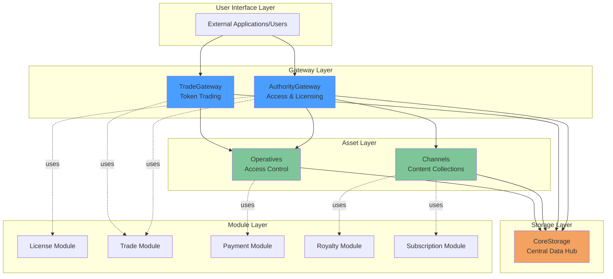
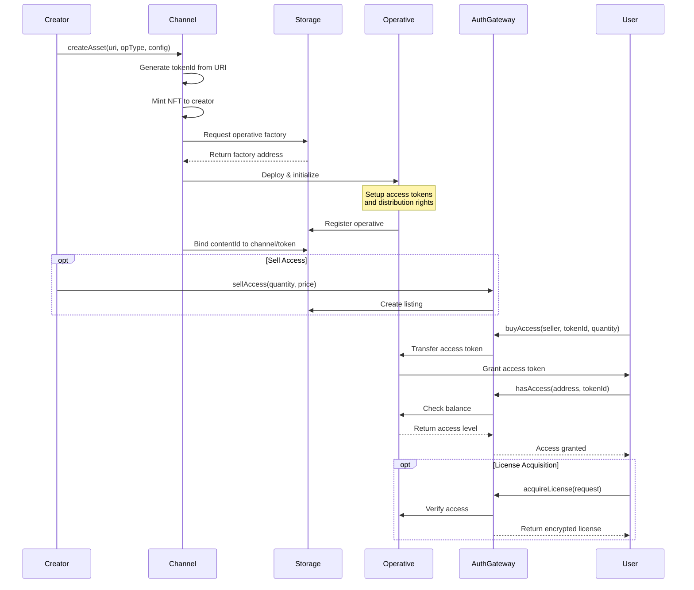
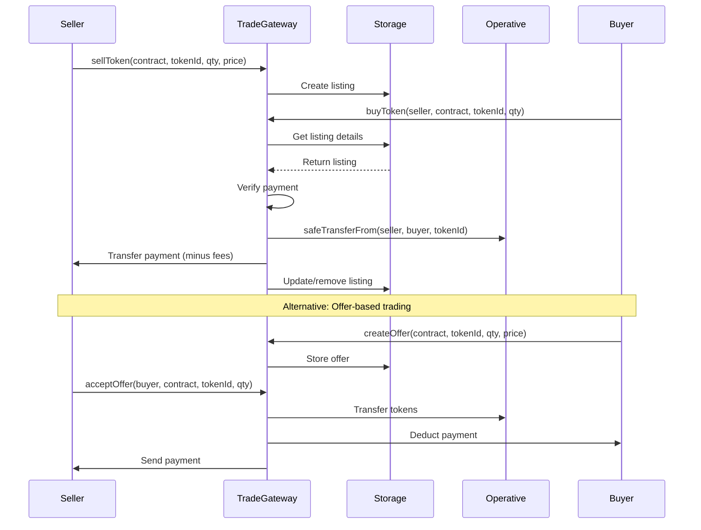
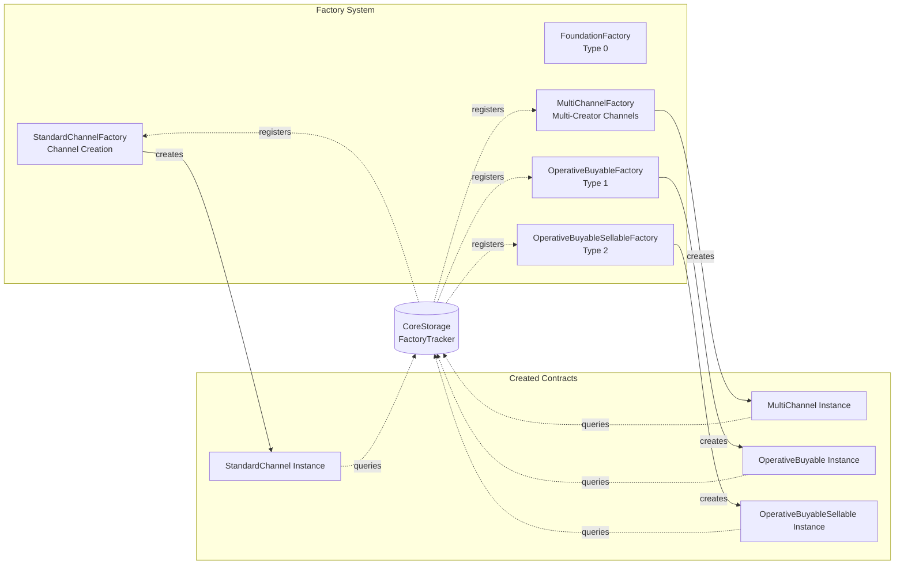

# Elacity DRM Contracts - Ecosystem Overview

This document provides a high-level summary of the Elacity DRM smart contracts ecosystem, designed to manage digital rights, access control, and marketplace operations for digital media assets on the blockchain.

## Vision & Purpose

The Elacity DRM ecosystem addresses limitations in current NFT standards (ERC-721, ERC-1155) by providing:
- **Advanced Digital Rights Management (DRM)** for encrypted content
- **Complex Royalty Distribution** supporting multiple stakeholders (inspired by EIP-4910, EIP-5553)
- **Cryptographic Licensing** for content access control
- **Flexible Marketplace** for buying, selling, and subscription-based access

## Architecture Layers

The ecosystem is structured in distinct layers, each serving specific purposes:



## Core Components

### 1. Gateway Contracts

Entry points for all user interactions with the ecosystem.

#### **AuthorityGateway**
The primary contract governing access to protected media content.

**Key Responsibilities:**
- License acquisition and validation
- Access token marketplace (buying/selling access rights)
- Checking user access permissions
- Supporting Lit Protocol for decentralized access control

**Core Functions:**
- `acquireLicense()` - Request cryptographic license for content
- `hasAccess()` - Check if user has access to content
- `hasAccessByContentId()` - Check access by content ID (KID)
- `sellAccess()` / `buyAccess()` - Marketplace for access tokens

#### **TradeGateway**
Handles all trading operations for digital asset tokens.

**Key Responsibilities:**
- Listing tokens for sale
- Buying/selling tokens
- Creating and managing offers
- Trade restrictions and permissions

**Core Functions:**
- `sellToken()` - List token for sale
- `buyToken()` - Purchase listed token
- `createOffer()` - Make an offer for a token
- `acceptOffer()` / `cancelOffer()` - Manage offers

### 2. Asset Layer

#### **Channels**
ERC-1155 contracts representing content collections or creator channels.

**Two Main Types:**
- **StandardChannel** (DigitalAssetPublic/Private) - Traditional content channels
- **MultiChannel** - Advanced multi-creator channels with complex configurations

**Features:**
- Token minting for unique digital assets
- Royalty share distribution
- Subscription management
- Token ownership-based access control

#### **Operatives**
Smart contracts that manage access control and rights distribution for individual assets.

**Types:**
1. **OperativeBuyable** (Type 1)
  - "Buy once, play always" model
  - Issues distribution rights to creators
  - Permanent access tokens

2. **OperativeBuyableSellable** (Type 2)
  - Full trade flexibility
  - Access tokens can be resold
  - Supports secondary markets

**Token Types in Operatives:**
- `ACCESS_TOKEN (1)` - Grants access to content
- `RESALE_RIGHT (2)` - Allows reselling access tokens
- `DISTRIBUTION_RIGHT (3)` - Creator's distribution rights

### 3. Module System

Reusable components providing specialized functionality across contracts.

| Module | Purpose |
|--------|---------|
| **LicenseModule** | Cryptographic license generation and validation using ECDH/ECDSA |
| **TradeModule** | Token/access marketplace logic (listings, offers, sales) |
| **PaymentModule** | Payment processing for native and ERC-20 tokens |
| **RoyaltyModule** | ERC-2981 enhanced royalty distribution |
| **SubscriptionModule** | Time-based subscription plans and access |
| **SecurityModule** | Access control and permission management |
| **IPMapperModule** | Maps content IDs (KIDs) to on-chain assets |
| **VerifierModule** | EIP-712 signature verification |

### 4. Storage Layer

#### **CoreStorage**
Centralized storage contract aggregating multiple trackers and registries.

**Composites:**
- **FactoryTracker** - Tracks factory contracts for channels and operatives
- **IPTracker** - Maps content IDs to channel/token pairs
- **MarketplaceTracker** - Stores listings, offers, and trade data
- **SystemTracker** - Tracks authorized operators and system contracts
- **ChannelRegistry** - Manages channel relationships and hierarchies
- **ContractRegistry** - Registry of system contracts
- **FeesInformation** - Platform fee configuration

## Content Flow

Here's how content is registered and accessed in the ecosystem:



## Trading Flow



## Factory Pattern

The ecosystem uses a factory pattern for creating channels and operatives:



## Key Features

### 🔐 Cryptographic Licensing
- ECDH key agreement for secure key exchange
- RC4/RC6 encryption support
- ECDSA signature verification (P256/Secp256k1)
- Lit Protocol integration for decentralized access control

### 💰 Advanced Royalty Distribution
- Multi-stakeholder royalty shares
- Configurable royalty percentages
- ERC-2981 enhanced implementation
- Support for complex IP ownership structures

### 🎫 Flexible Access Models
- **Permanent Access**: Buy once, own forever (OperativeBuyable)
- **Tradeable Access**: Resellable access rights (OperativeBuyableSellable)
- **Subscription-based**: Time-limited access with renewable plans
- **Token-gated**: Access based on external token ownership

### 🏪 Marketplace Features
- Direct listings with fixed prices
- Offer/counter-offer system
- Native token (ETH) and ERC-20 support
- Platform fee collection
- Trade restrictions and permissions

### 🔄 Upgradeable Architecture
- Uses OpenZeppelin upgradeable contracts
- Versioning system for contract iterations
- Beacon proxy pattern for operatives
- Reinitializer pattern for safe upgrades

## Contract Versioning

The ecosystem uses a structured versioning scheme:

```
VERSION = 0x0000000200000600
         └─┬─┘ └┬┘ └┬┘ └┬┘ └┬┘
           │    │   │   │   └─ Patch (0x00)
           │    │   │   └───── Build version (0x06)
           │    │   └───────── Minor iteration (0x00)
           │    └───────────── Major version (0x00)
           └────────────────── Ecosystem version (0x02)

Current: v2.0.0-8.1
```

This ensures safe upgrades using OpenZeppelin's `reinitializer(uint64)` pattern.

## Technology Stack

- **Solidity**: ^0.8.20
- **Standards**: ERC-1155, ERC-2981, ERC-4910, ERC-4970, ERC-5501
- **Upgrades**: OpenZeppelin Upgradeable Contracts
- **Cryptography**: Custom elliptic curve implementations (P256, Secp256k1)
- **Access Control**: Role-based permissions (OpenZeppelin AccessControl)

## Use Cases

1. **Music Streaming Platforms**: Sell access tokens for individual songs or albums
2. **Video Content**: Subscription-based access to video libraries
3. **E-books & Publications**: Permanent ownership with DRM protection
4. **Software Licensing**: Cryptographic license keys for software distribution
5. **NFT Marketplaces**: Advanced trading with royalty enforcement

## Security Considerations

- All gateway contracts are **upgradeable** via proxy pattern
- **Role-based access control** for administrative functions
- **Whitelisting** for authorized contracts
- **Signature verification** for off-chain authorization
- **Reentrancy protection** on payment functions
- **Transfer restrictions** for sensitive token types

---

> **Note**: This ecosystem is designed for production use with comprehensive DRM capabilities. For implementation details, refer to individual contract documentation in the [Contracts](../Contracts/README.md) section.
