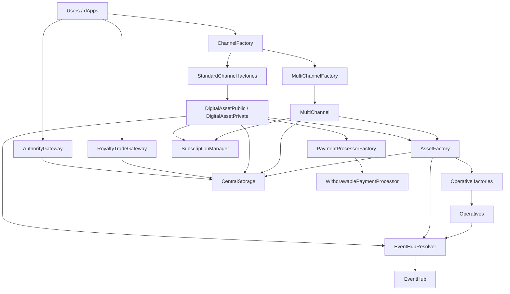

# Elacity V3 Contracts — Ecosystem Overview

This page describes the current smart-contract architecture in `v3-drm-protocol`.

## What changed from legacy

- `CoreStorage` -> `CentralStorage`
- `ChannelCore` -> `ChannelFactory`
- `TradeGateway` -> `RoyaltyTradeGateway`
- `DigitalAssetCreator` flow -> explicit `AssetFactory` orchestration
- `IPMapperModule` behavior consolidated into `IPTracker`
- subscription path moved toward `SubscriptionManager` + channel delegation
- selected event classes centralized through `EventHub`

## Current architecture

## Main runtime flows

### 1) Channel creation

1. `ChannelFactory.createChannel(...)` routes by channel type/scope.
2. Concrete factory deploys beacon proxy channel.
3. Channel is registered/acknowledged through storage/system tracking.

### 2) Asset mint and protective flow

1. Creator mints via channel.
2. Channel delegates protective registration to `AssetFactory`.
3. `AssetFactory` deploys operative by `opType`.
4. `AssetFactory` writes operative mapping + content binding via storage trackers.

### 3) Access-token marketplace

1. Seller lists in `AuthorityGateway.sellAccess`.
2. Buyer executes native/ERC-20 `buyAccess`.
3. Listing and payouts are accounted through marketplace/payment modules.

### 4) Royalty-share marketplace

1. Holder lists in `RoyaltyTradeGateway.sellToken`.
2. Buyers purchase directly or through offer lifecycle.
3. Trade restrictions and payout logic apply.

### 5) Subscription

1. User calls channel `subscribePlan(uint8 planId, bytes args)`.
2. Channel delegates workflow/state logic to `SubscriptionManager`.
3. Access checks may resolve through subscription or operative ownership.

### 6) Event routing

- Supported classes are emitted via EventHub.
- Missing mandatory hub resolution reverts through resolver error paths.

## Contract entrypoints you should use today

- Channel creation: `ChannelFactory`
- Access-market actions: `AuthorityGateway`
- Royalty-share and general ERC-1155 trading: `RoyaltyTradeGateway`
- Storage/system inspection: `CentralStorage`
- Subscription management (runtime backend): `SubscriptionManager`

## Further reading

- [History Digest](../manual/history-digest.md)
- [Legacy to V3 ABI Migration Guide](../manual/legacy-to-v3-abi-migration.md)
- [Current Architecture](../manual/current-architecture.md)
- [Contract References](../references/README.md)
