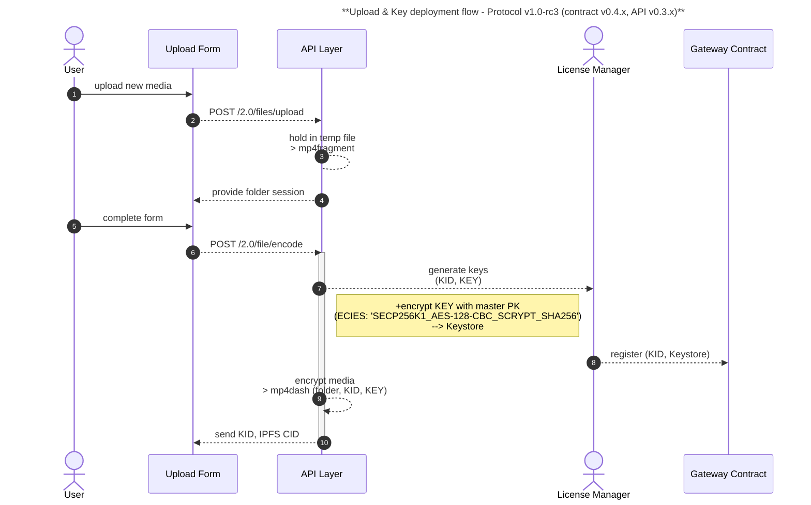
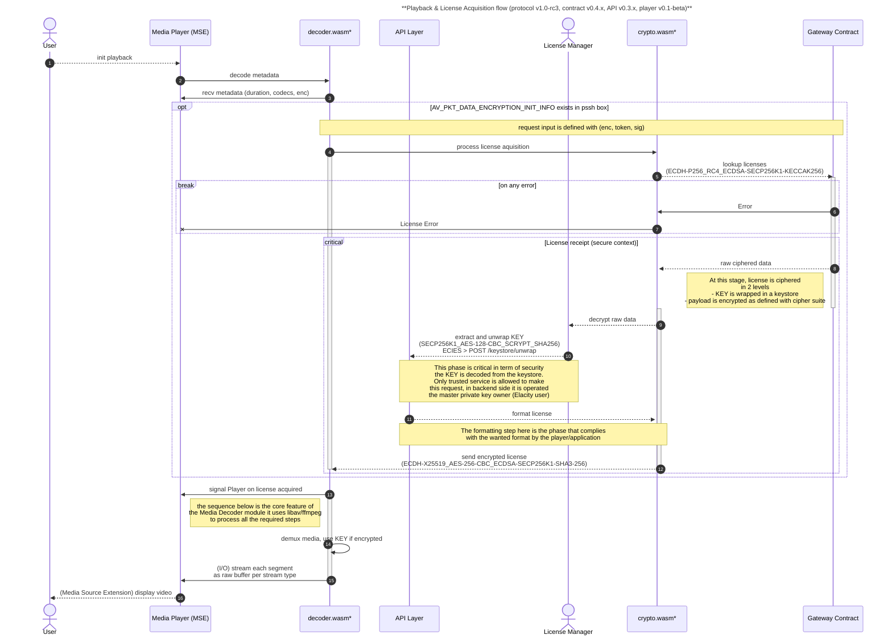
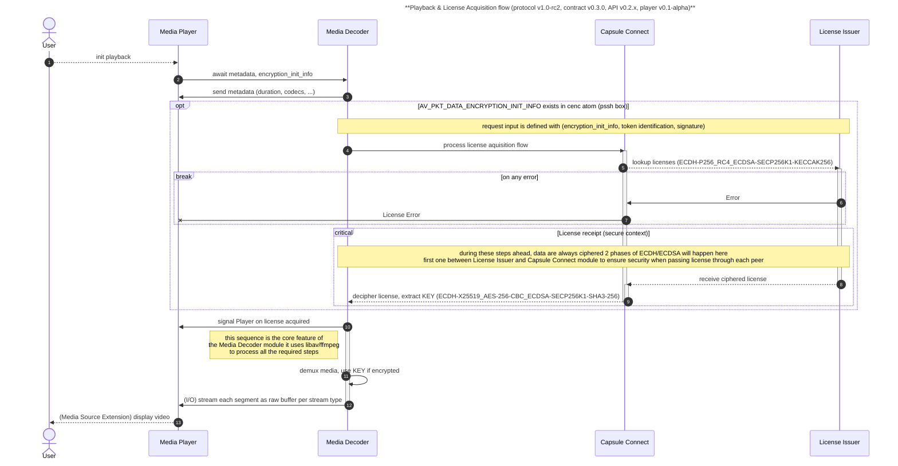

# Protocol

### Protocol v1.0-rc3 (latest)
#### Keys deployment

```mermaid
%%{
  init: {
    "fontFamily": "monospace"
  }
}%%
sequenceDiagram
    title **Upload & Key deployment flow - Protocol v1.0-rc3 (contract v0.4.x, API v0.3.x)**
    autonumber
    actor U as User
    participant App as Upload Form
    participant Api as API Layer
    actor L as License Manager
    participant GC as Gateway Contract
    U ->> App: upload new media
    App -->> Api: POST /2.0/files/upload
    Api --> Api: hold in temp file<br/>> mp4fragment
    Api -->> App: provide folder session
    U ->> App: complete form
    App -->> Api: POST /2.0/file/encode
    activate Api
    Api -->> L: generate keys<br/>(KID, KEY)
    note left of L: +encrypt KEY with master PK<br/>(ECIES: 'SECP256K1_AES-128-CBC_SCRYPT_SHA256')<br/>--> Keystore
    L -->> GC: register (KID, Keystore)
    Api -->> Api: encrypt media <br/>> mp4dash (folder, KID, KEY)
    Api -->> App: send KID, IPFS CID
    deactivate Api
```

#### Playback flow & License Acquisition

```mermaid
%%{
  init: {
    "fontFamily": "monospace"
  }
}%%
sequenceDiagram
    title **Playback & License Acquisition flow (protocol v1.0-rc3, contract v0.4.x, API v0.3.x, player v0.1-beta)**
    autonumber
    actor U as User
    participant P as Media Player (MSE)
    participant ModX as decoder.wasm*
    participant Api as API Layer
    actor L as License Manager
    participant ModC as crypto.wasm*
    participant Lic as Gateway Contract
    U -->> P: init playback
    P ->> ModX: decode metadata
    ModX ->> P: recv metadata (duration, codecs, enc)
    opt AV_PKT_DATA_ENCRYPTION_INIT_INFO exists in pssh box
        note over ModX, Lic : request input is defined with (enc, token, sig)
        ModX ->> ModC: process license aquisition
        activate ModX
        ModC -->> Lic: lookup licenses<br/>(ECDH-P256_RC4_ECDSA-SECP256K1-KECCAK256)
        activate Lic
        break on any error
            Lic ->> ModC: Error
            ModC -x P: License Error
        end
        critical License receipt (secure context)
            Lic -->>+ ModC: raw ciphered data 
            Note left of Lic: At this stage, license is ciphered<br/>in 2 levels<br/>- KEY is wrapped in a keystore<br/>- payload is encrypted as defined with cipher suite
            deactivate Lic
            activate ModC
            ModC -->> L: decrypt raw data
            L -->> Api: extract and unwrap KEY<br/>(SECP256K1_AES-128-CBC_SCRYPT_SHA256)<br/>ECIES > POST /keystore/unwrap
            note over Api, L: This phase is critical in term of security<br/>the KEY is decoded from the keystore.<br/> Only trusted service is allowed to make<br/>this request, in backend side it is operated<br/>the master private key owner (Elacity user)
            Api -->> ModC: format license
            note over Api, ModC: The formatting step here is the phase that complies<br/>with the wanted format by the player/application
            ModC -->> ModX: send encrypted license<br/>(ECDH-X25519_AES-256-CBC_ECDSA-SECP256K1-SHA3-256)
            deactivate ModC
            deactivate ModX
        end
    end
    ModX ->> P: signal Player on license acquired
    activate ModX
    note left of ModX: the sequence below is the core feature of<br/> the Media Decoder module it uses libav/ffmpeg<br/> to process all the required steps
    ModX ->> ModX: demux media, use KEY if encrypted
    ModX ->> P: (I/O) stream each segment<br/>as raw buffer per stream type
    deactivate ModX
    P -->> U: (Media Source Extension) display video
```

### Protocol v1.0-rc2

```mermaid
%%{
  init: {
    "fontFamily": "monospace"
  }
}%%
sequenceDiagram
    title **Playback & License Acquisition flow (protocol v1.0-rc2, contract v0.3.0, API v0.2.x, player v0.1-alpha)**
    autonumber
    actor U as User
    participant P as Media Player
    participant ModX as Media Decoder
    participant ModC as Capsule Connect
    participant Lic as License Issuer
    U -->> P: init playback
    P ->> ModX: await metadata, encryption_init_info
    ModX ->> P: send metadata (duration, codecs, ...)
    opt AV_PKT_DATA_ENCRYPTION_INIT_INFO exists in cenc atom (pssh box)
        note over ModX, Lic : request input is defined with (encryption_init_info, token identification, signature)
        ModX ->> ModC: process license aquisition flow
        activate ModC
        ModC -->> Lic: lookup licenses (ECDH-P256_RC4_ECDSA-SECP256K1-KECCAK256)
        activate Lic
        break on any error
            Lic ->> ModC: Error
            ModC -x P: License Error
        end
        critical License receipt (secure context)
            note over ModX, Lic: during these steps ahead, data are always ciphered 2 phases of ECDH/ECDSA will happen here<br/>first one between License Issuer and Capsule Connect module to ensure security when passing license through each peer
            Lic -->>+ ModC: receive ciphered license
            deactivate Lic
            ModC -->>- ModX: decipher license, extract KEY (ECDH-X25519_AES-256-CBC_ECDSA-SECP256K1-SHA3-256)
            deactivate ModC
        end
    end
    ModX ->> P: signal Player on license acquired
    activate ModX
    note left of ModX: this sequence is the core feature of<br/> the Media Decoder module it uses libav/ffmpeg<br/> to process all the required steps
    ModX ->> ModX: demux media, use KEY if encrypted
    ModX ->> P: (I/O) stream each segment as raw buffer per stream type
    deactivate ModX
    P -->> U: (Media Source Extension) display video
```