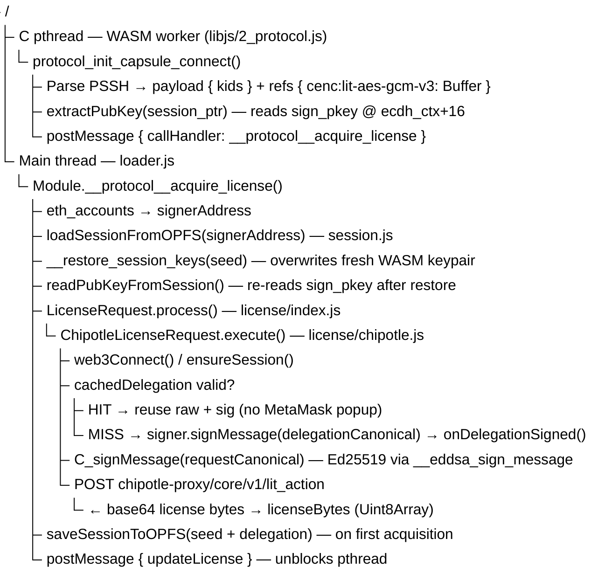
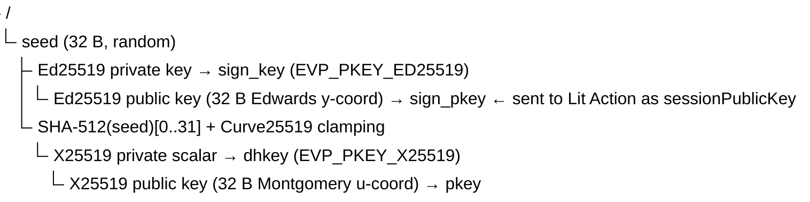

# Chipotle License Protocol (`cenc:lit-aes-gcm-v3`)

This document covers the full implementation of the Chipotle DRM path — from PSSH parsing through C-side key derivation to the Lit Action call — including session keypair persistence and wallet-signature caching. It is intended as both a technical reference and an AI-context handover.

---

## Overview

`cenc:lit-aes-gcm-v3` is the current production DRM variant. It replaces the older `cenc:lit-drm-v1` / `cenc:lit-drm-sa-v1` path. The key differences:

| Aspect | Old (`lit-drm-v1`) | New (`lit-aes-gcm-v3`) |
|---|---|---|
| Session keypair | X25519 only | Ed25519 (signing) + X25519 (ECDH), shared scalar |
| Key exchange | Basic ECDH | ECDH + Ed25519 request signature |
| Wallet signature | Per-call | Cached delegation (1-hour TTL), persisted to OPFS |
| Lit Action | `LitLicenseRequest` | `ChipotleLicenseRequest` |
| Backend | Direct Lit nodes | `chipotle-proxy` Cloud Function (`https://europe-west1-elacity.cloudfunctions.net/chipotle-proxy`) |
| PSSH system ID | `b7855546-...` | `bf2c86c1-d9ff-4ab1-b4be-45ae4d99e1fe` |

---

## File Map

| Path | Role |
|---|---|
| `src/protocol/protocol.c` | C: session alloc/free, `license_parse_raw`, KEEPALIVE exports |
| `src/protocol/ecdh.c` / `ecdh.h` | C: Ed25519+X25519 keypair generation and seed restore |
| `libjs/2_protocol.js` | WASM JS-library: pthread→main-thread bridge, `extractPubKey` |
| `packages/player/src/loader.js` | Main thread: WASM module config, `__protocol__acquire_license` |
| `packages/player/src/session.js` | OPFS helpers: load / save / clear session |
| `packages/player/src/license/chipotle.js` | JS: wallet connect, delegation, Lit Action HTTP call |
| `packages/player/src/license/index.js` | JS: `LicenseRequest` dispatcher — routes `cenc:lit-aes-gcm-v3` to Chipotle |

---

## End-to-End Data Flow



---

## C-Side: Session Keypair (`ecdh.c` / `protocol.c`)

### Keypair design

Both the signing key (Ed25519) and the ECDH key (X25519) share the same Curve25519 scalar, derived deterministically from a single 32-byte seed:



The Lit Action receives `sign_pkey` (Ed25519 pub) as `sessionPublicKey`. It:
1. Verifies `requestSig` using Ed25519.
2. Converts `ed25519ToX25519(sessionPublicKey)` to get the X25519 peer key for the ECDH step that produces the CEK envelope.

### Key functions

```c
// Generate fresh keypair (called by protocol_alloc_session)
int crypto_generate_session_keys(CryptoECDHContext *ctx);

// Rebuild keypair from stored seed (called by _restore_session_keys)
int crypto_generate_session_keys_from_seed(CryptoECDHContext *ctx, const uint8_t *seed);

// WASM exports (JS: Module.__get_session_seed / Module.__restore_session_keys / Module.__eddsa_sign_message)
EMSCRIPTEN_KEEPALIVE int _get_session_seed(LicenseRetrievalSession*, uint8_t *seed_out);
EMSCRIPTEN_KEEPALIVE int _restore_session_keys(LicenseRetrievalSession*, const uint8_t *seed);
EMSCRIPTEN_KEEPALIVE int _eddsa_sign_message(LicenseRetrievalSession*, const uint8_t *msg, size_t, uint8_t *sig_out);
```

> **Emscripten naming**: `_foo` in C → `Module.__foo` in JS (Emscripten prepends one underscore, the leading `_` in the C name becomes `__` on the JS side).

### Double-free fix

`crypto_ecdh_derive_key` unconditionally frees `dhkey` in its `end:` cleanup. `protocol_session_free` also called `EVP_PKEY_free(ctx->dhkey)`. The second free corrupted OpenSSL's internal method pointer table, causing a WASM `call_indirect` type mismatch on subsequent `EVP_PKEY_free(sign_key)`.

Fix: null the pointer immediately after calling `crypto_ecdh_derive_key`:
```c
int dh_ret = crypto_ecdh_derive_key(session->ecdh_ctx->dhkey, ...);
session->ecdh_ctx->dhkey = NULL;  // always freed inside derive_key
```

### `CryptoECDHContext` WASM32 memory layout

Critical for reading the public key from the main thread without a C export:

```
offset  0  EVP_PKEY *dhkey       (4 B pointer — X25519 private key)
offset  4  uint8_t *pkey         (4 B pointer — X25519 public key bytes)
offset  8  size_t   pkey_size    (4 B)
offset 12  EVP_PKEY *sign_key    (4 B pointer — Ed25519 private key)
offset 16  uint8_t *sign_pkey    (4 B pointer — Ed25519 public key bytes) ← used by extractPubKey
offset 20  size_t   sign_pkey_size (4 B)
```

`LicenseRetrievalSession` offsets:
```
offset  0  License*        (4 B)
offset  4  is_error        (4 B)
offset  8  authority       (4 B)
offset 12  signer          (4 B)
offset 16  sig             (4 B)
offset 20  kids            (4 B)
offset 24  kids_count      (4 B)
offset 28  CryptoECDHContext* ← ecdh_ctx pointer
```

Reading `sign_pkey` on the main thread (used both in `2_protocol.js` and `loader.js`):
```js
const ecdh_ctx_ptr = HEAPU32[(session_ptr + 28) >> 2];
const pubKeyPtr    = HEAPU32[(ecdh_ctx_ptr + 16) >> 2];
const pubKeyLen    = HEAPU32[(ecdh_ctx_ptr + 20) >> 2];
// result: lowercase hex string, no 0x prefix, 64 chars (32 bytes)
```

---

## PSSH Registration

The `cenc:lit-aes-gcm-v3` system uses PSSH system ID `bf2c86c1-d9ff-4ab1-b4be-45ae4d99e1fe` (base64: `vyyGwdn/SrG0vkWuTZnh/g==`). Registered in `libjs/2_protocol.js` as `SYSID_DRMLIT_V3`. The PSSH data field carries the body JSON (authority address, chainId, ciphertext, etc.).

---

## JS-Side: `ChipotleLicenseRequest` (`chipotle.js`)

### Constructor options

```js
new ChipotleLicenseRequest({
  player,
  provider,            // window.ethereum or WalletConnect provider
  accountOverride,     // explicit signer address (optional)
  logger,
  cachedDelegation,    // { raw: string, sig: string, expiresAt: number } | null
  onDelegationSigned,  // callback(delegation) — called after a new wallet signature
})
```

### Two-level signing

Every license call requires two signatures:

1. **Delegation** — signed by the owner's wallet via `signer.signMessage()`. Contains `ownerAddress`, `coveredAddresses`, `sessionPublicKey`, `actionIpfsId`, `chainId`, TTL of 1 hour. Has no media-specific content → **safe to cache and reuse** across different media for the same session.

2. **Request** — signed by the C-side Ed25519 key via `Module.__eddsa_sign_message`. Contains `kid`, `actionIpfsId`, per-call nonce. Always fresh, never cached.

### Delegation cache check

Before calling `signer.signMessage`, the cached delegation is validated against:
- `cached.expiresAt > now`
- `parsed.sessionPublicKey === sessionPublicKey` (same WASM keys)
- `parsed.actionIpfsId === actionIpfsId` (same Lit Action)
- `parsed.chainId === sessionChainId` (same network)

On a cache hit, `signer.signMessage` is skipped entirely — no MetaMask popup.

### `actionIpfsId` upgrade map

Some older PSSH bodies reference deprecated Lit Action CIDs. `ipfsUpgradeMap` in `chipotle.js` silently rewrites them to the current CID before use.

### `canonicalize(v)`

A deterministic JSON serialiser (keys sorted, no whitespace) used so both C-side and JS-side produce the same byte string when signing structured objects. Required because `JSON.stringify` key order is not guaranteed.

---

## JS-Side: Session Persistence (`session.js` + `loader.js`)

See [`session-keypair-storage.md`](./session-keypair-storage.md) for security analysis. Summary of the implementation:

### OPFS file format

Path: `/session/<signerAddress_lowercase>/key.bin`

```
bytes  0-3   u32 BE — high 32 bits of seed expiresAt (Unix seconds)
bytes  4-7   u32 BE — low 32 bits of seed expiresAt
bytes  8-39  32-byte Ed25519 private seed
bytes 40-43  u32 BE — byte length of trailing JSON (0 = no delegation cached)
bytes 44+    UTF-8 JSON { raw: string, sig: string, expiresAt: number }
```

The seed alone is enough to reconstruct both the Ed25519 signing key and the X25519 ECDH key (via `crypto_generate_session_keys_from_seed`).

### Address resolution

`setup()` is called before the wallet connects, so the signer address is unknown there. The address is resolved lazily at the top of every `__protocol__acquire_license` call:

```js
let signerAddress = accountOverride;
if (!signerAddress && provider) {
  const accounts = await provider.request({ method: 'eth_accounts' });
  signerAddress = accounts?.[0] || null;
}
```

`eth_accounts` returns already-connected accounts without triggering a MetaMask popup.

### Session lifecycle

```
Page load
  setup({ session: { expiresAt: now + 30d } })
    → sessionConfig = { expiresAt }
    → address not known yet; OPFS load deferred

License acquisition (first time)
  signerAddress ← eth_accounts
  loadSessionFromOPFS → null (no file)
  WASM generates fresh keypair
  Delegation signed by wallet (MetaMask popup)
  onDelegationSigned → signedDelegation = { raw, sig, expiresAt }
  Lit Action called → license bytes
  __get_session_seed → seed extracted from WASM
  saveSessionToOPFS(signerAddress, seed, expiresAt, signedDelegation)
  persistedSession = { seed, expiresAt, delegation: signedDelegation }

Page reload → License acquisition (subsequent)
  signerAddress ← eth_accounts
  loadSessionFromOPFS → { seed, expiresAt, delegation }
  __restore_session_keys(seed) → WASM keypair replaced
  readPubKeyFromSession → same Ed25519 pubkey as before
  cachedDelegation valid → delegation reused → NO MetaMask popup
  Lit Action called → license bytes
```

---

## `loader.js`: `__protocol__acquire_license` structure

The function is a synchronous shell wrapping an async IIFE so that OPFS reads, session restore, license acquisition, and OPFS writes can all `await` without blocking the main thread synchronously:

```js
__protocol__acquire_license: function (player, ledger, tokenId, pssh_box, refs, pubKey, session_ptr, pthread_ptr, ch_ptr) {
  const failLicenseAcquisition = (err) => { /* signals pthread + player */ };

  (async () => {
    // 1. resolve signerAddress (eth_accounts fallback)
    // 2. lazy load from OPFS
    // 3. restore WASM keypair if loaded
    // 4. build onDelegationSigned callback
    // 5. create LicenseRequest with cachedDelegation
    // 6. await l.process(...)
    // 7. save to OPFS on first acquisition
    // 8. postMessage { updateLicense } to pthread
  })().catch(failLicenseAcquisition);
}
```

---

## `setup()` — Required Configuration

Callers **must** pass `session.expiresAt` for persistence to activate:

```js
await MediaPlayer.setup({
  provider: window.ethereum,
  session: {
    expiresAt: Math.floor(Date.now() / 1000) + 30 * 24 * 3600, // 30 days
    // signerAddress: '0x...'  // optional, avoids the eth_accounts call
  },
  drmSystem: {
    'cenc:lit-aes-gcm-v3': { priority: 0 },
    'cenc:web3-drm-v1': { priority: 9 },
  },
});
```

Without `session.expiresAt`, `sessionConfig` is null and all OPFS guards are permanently false — nothing is ever saved or loaded.

---

## `initfs.c` — Segment Template Resolution

`resolve_effective_segment_template` was added to correctly handle the two-level DASH inheritance model where a `SegmentTemplate` can live on either the `AdaptationSet` or the `Representation`. Fields (initialization, media, startNumber, SegmentTimeline) cascade from representation level down to adaptation level, so a representation-level value always wins. This fixed segment URL construction for mp4dash-issuance streams.

Also fixed: after parsing license metadata (issuer + expiration), the data pointer now advances by the full `metadata_size` rather than only 8 bytes. This ensures fields beyond the standard issuer+expiration block (e.g. audience) don't bleed into the key-count read.

---

## Known Limitations

- **OPFS has no encryption at rest** — same-origin XSS can read the raw 32-byte seed. See `session-keypair-storage.md` for the full threat model.
- **Delegation TTL is 1 hour** — after expiry, one new MetaMask prompt is required to refresh it. The new delegation is written back to OPFS immediately.
- **`clearSessionFromOPFS(address)`** is exported from `session.js` but has no caller yet. Wire it up to wallet-disconnect / logout events in the consuming app.
- **`session.expiresAt` is the seed lifetime** — it controls when the OPFS file is considered expired and deleted. Setting it far in the future (e.g. 30 days) means the same keypair is reused until it expires, independent of the 1-hour delegation TTL.
