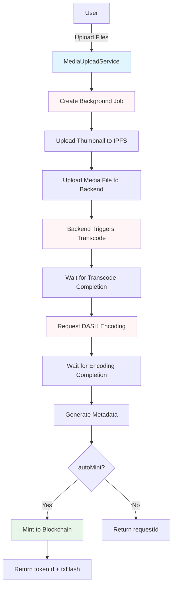

# Media Upload Workflow Architecture

> **Last Updated**: 2025-01-29

## Overview

The media upload workflow transforms user-submitted video/audio content into blockchain-backed NFTs with DRM (Digital Rights Management) protection. This document describes the architecture and flow of the `@elacity-js/media-packager` package.

## High-Level Flow



## Component Architecture

```
MediaUploadService
├── FileUploader
│   ├── FormDataAdapter (browser/Node.js)
│   ├── uploadThumbnail() → IPFS
│   ├── uploadMediaFile() → Backend
│   └── uploadMetadataFolder() → IPFS
├── MediaEncoder
│   ├── requestEncoding() → Backend API
│   └── waitForEncodingCompletion() → Strategy Pattern
│       ├── WorkflowListenerFactory → Selects best strategy
│       ├── FirebaseListenerStrategy → Real-time Firebase (Priority 10)
│       └── PollingListenerStrategy → Poll background jobs (Priority 1)
├── BackgroundJobService (from @elacity-js/api)
│   ├── createBackgroundJob()
│   ├── updateBackgroundJob()
│   └── generateMetadata()
└── StandardChannel (from @elacity-js/contracts)
    └── mint() → Blockchain
```

## Workflow Steps

### Step 1: Create Background Job (0%)

Creates a background job entity to track the entire workflow:

```typescript
const job = await apiClient.backgroundJobs.createBackgroundJob({
  title: `Uploading: ${input.title}`,
  status: JobStatus.INITIALIZED,
  payload: input,
  steps: [
    { step: 'upload_file', status: JobStatus.PENDING },
    { step: 'transcode', status: JobStatus.INITIALIZED },
    { step: 'dash_encode', status: JobStatus.INITIALIZED },
    { step: 'generate_metadata', status: JobStatus.INITIALIZED },
    { step: 'broadcast_tx', status: JobStatus.INITIALIZED },
  ],
});
```

**Returns:** Background job with `requestId`

---

### Step 2: Upload Thumbnail (5%)

Uploads thumbnail image to IPFS:

```typescript
const thumbnailCID = await uploader.uploadThumbnail(thumbnail, title);
// POST /2.0/files/upload
// Headers: { 'X-Target-Flow': 'ipfs' }
// Returns: [{ path: 'Qm...' }] - IPFS CID
```

**Backend Processing:**
- Receives file via FormData
- Uploads to IPFS
- Returns IPFS CID

---

### Step 3: Upload Media File (10-40%)

Uploads raw media file to backend storage:

```typescript
const result = await uploader.uploadMediaFile(file, {
  onProgress: (progress) => {
    // Progress: 0-100% mapped to 10-40% of overall workflow
  },
});
// POST /2.0/files/upload
// Returns: { path: '/uploads/...', requestId: '...' }
```

**Backend Processing:**
- Stores file in backend storage
- Triggers `wf-transcode-requests` Google Workflow
- Returns `uploadedPath` and `requestId`

**Progress Tracking:**
- Browser: XMLHttpRequest `upload.onprogress` events
- Node.js: No progress tracking (uses fetch)

---

### Step 4: Wait for Transcode (40-50%)

Waits for backend transcode workflow to complete:

```typescript
await waitForTranscode(requestId, (progress) => {
  // Polls background job for transcode step completion
  // Updates progress based on step status
});
```

**Implementation:**
- Polls `backgroundJobs.retrieveBackgroundJob(requestId)` every 2 seconds
- Checks `transcode` step status
- Estimates progress based on `estimatedDuration` and elapsed time
- Completes when step status = `COMPLETED`

**Backend Workflow:**
- Google Workflow transcodes media to h264/av1
- Enforces max 1080p resolution
- Publishes progress to Firebase (frontend can listen)
- Updates background job when complete

---

### Step 5: Request Encoding (50-90%)

Requests DASH encoding with DRM protection:

```typescript
const encodeResult = await encoder.requestEncoding({
  path: transcodeResult.uploadedPath,
  payload: {
    requestId,
    title,
    thumbnailHash: thumbnailCID,
    accessMethod: 'B', // A=free, B=buy_once, C=resellable
    encrypted: '1',
    protectionType: 'CencDRM_V1',
    price: '4.99',
    payToken: '0x...',
    ledger: channelAddress,
    authority: gatewayAddress,
    publisher: creatorAddress,
  },
});

// Wait for completion
const result = await encodeResult.waitCompletion();
```

**Backend Processing:**
- Triggers `wf-encode-requests` Google Workflow
- Creates MPEG-DASH segments
- Applies CENC (Common Encryption) DRM
- Generates KID (Key ID) for DRM
- Creates preview content
- Generates ISCC fingerprint

**Completion:**
- **Strategy Pattern**: `WorkflowListenerFactory` selects best available strategy
- **Frontend**: FirebaseListenerStrategy (if Firebase initialized) or PollingListenerStrategy (fallback)
- **Backend**: PollingListenerStrategy (Firebase not available in Node.js)

**Returns:**
```typescript
{
  cid: string;           // IPFS CID of encoded content
  kid: string;          // DRM Key ID
  size: number;         // File size in bytes
  previewURL?: string;  // Preview content URL
  metadata: { ... };    // Encoding metadata
  dna: {                // ISCC fingerprint
    iscc: string;
    bits: string[];
  };
}
```

---

### Step 6: Generate Metadata (90-95%)

Generates IPFS metadata URI:

```typescript
const metadataURI = await apiClient.backgroundJobs.generateMetadata(requestId, {
  thumbnailCID,
  encodeResult,
  input,
});
```

**Backend Processing:**
- Creates metadata folder structure:
  - `metadata.json` - Main NFT metadata
  - `content.json` - Content metadata
  - `contract.json` - MCO contract data
  - Token metadata files (access tokens, royalty shares, etc.)
- Uploads folder to IPFS as directory
- Returns IPFS CID

---

### Step 7: Mint to Blockchain (95-100%, Optional)

Mints NFT using channel contract:

```typescript
const mintResult = await mintToBlockchain(
  requestId,
  channelAddress,
  metadataURI,
  encodeResult,
  input
);
```

**Process:**
1. Format mint data using `formatMintData()`
2. Encode operative and sell data using ABI encoder
3. Call `channel.mint(metadataURI, opType, opRawData, sellRawData)`
4. Wait for transaction confirmation
5. Extract token ID from transaction

**Smart Contract Call:**
```solidity
mint(
  string metadataURI,      // "ipfs://Qm.../metadata.json"
  uint16 opType,           // 0=free, 1=buy_once, 2=resellable
  bytes opRawData,         // Encoded operative data
  bytes sellRawData        // Encoded sell data
)
```

**Events Emitted:**
- `AssetCreated(tokenId, metadataURI, creator)`
- `DigitalAssetRegistered(tokenId, ledger, operativeContract)`

## Progress Distribution

| Stage | Progress Range | Duration Est. | Updated By |
|-------|---------------|---------------|------------|
| Create Job | 0% | ~1s | Service |
| Upload Thumbnail | 5% | ~5s | Service |
| Upload Media | 10-40% | ~30s-2min | FileUploader (XMLHttpRequest) |
| Transcode | 40-50% | ~2-4 min | Background Job Polling |
| Encode DASH | 50-90% | ~4-8 min | Firebase Listener / Polling |
| Generate Metadata | 90-95% | ~10s | Service |
| Mint | 95-100% | ~15-30s | Service |

## Error Handling

### Automatic Error Handling

The service automatically:
- Updates background job status to `FAILED` on errors
- Marks the failed step with error details
- Preserves job state for debugging

### Error Recovery

```typescript
try {
  const result = await mediaService.execute(input, options);
} catch (error) {
  // Retrieve job to see which step failed
  const job = await apiClient.backgroundJobs.retrieveBackgroundJob(result.requestId);
  const failedStep = job.steps?.find(s => s.status === JobStatus.FAILED);
  
  console.error('Failed at:', failedStep?.step);
  console.error('Error:', failedStep?.caption);
  
  // User can retry from the failed step
}
```

## Frontend vs Backend Differences

### Frontend (Browser)

**Strategy Selection:**
- `WorkflowListenerFactory` checks available strategies
- **FirebaseListenerStrategy** selected if Firebase Firestore initialized (Priority 10)
- **PollingListenerStrategy** selected as fallback if Firebase unavailable (Priority 1)
- XMLHttpRequest progress tracking for file uploads

**Requirements:**
- Browser environment with File API
- Firebase initialized (optional - polling fallback available)

### Backend (Node.js)

**Strategy Selection:**
- **PollingListenerStrategy** automatically selected (Firebase not available)
- Polls background job API every 2 seconds
- No Firebase dependency needed
- Suitable for server-side processing

**Requirements:**
- `form-data` package for FormData support
- File-like objects instead of browser File objects
- Background job service available via `apiClient.backgroundJobs`

## Integration Points

### With API SDK

- **BackgroundJobService**: Workflow tracking
- **HttpClient**: File uploads and API calls
- **AuthManager**: Authentication for API calls

### With Contracts SDK

- **StandardChannel**: NFT minting
- **IContractRunner**: Transaction execution
- **EthersAdapter/ViemAdapter**: Contract runner implementations

### With Backend

- **Upload Endpoint**: `/2.0/files/upload`
- **Encode Endpoint**: `/2.0/files/encode`
- **GraphQL API**: Background job management
- **Google Workflows**: Transcode and encode processing
- **Firebase**: Real-time progress updates (frontend)

## Related Documentation

- [Media Upload Service](../services/media-upload-service.md) - API reference
- [Background Job Service](../../api/services/background-job.md) - Workflow tracking
- [Media Minting Process](../../../../elacity-web/docs/wiki/Technical/Media-Minting-Process.md) - Frontend implementation details
