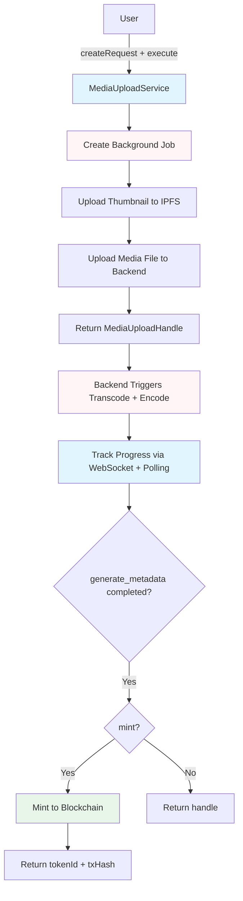
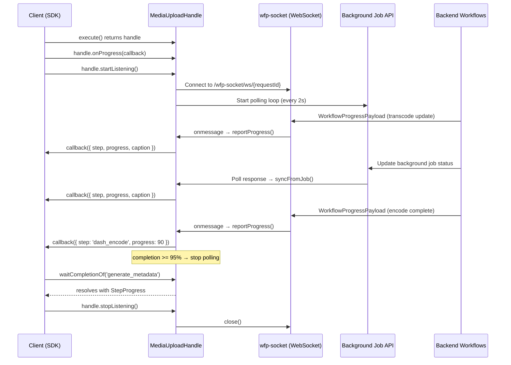

# Media Upload Workflow Architecture

> **Last Updated**: 2026-02-12

## Overview

The media upload workflow transforms user-submitted video/audio content into blockchain-backed NFTs with DRM (Digital Rights Management) protection. This document describes the architecture and flow of the `@elacity-js/media-packager` package.

## High-Level Flow



## WebSocket Progress Flow



## Component Architecture

```
MediaUploadService
├── FileUploader
│   ├── FormDataAdapter (browser/Node.js)
│   ├── uploadThumbnail() → IPFS
│   ├── uploadMediaFile() → Backend
│   └── uploadMetadataFolder() → IPFS
├── MediaUploadHandle (from transport.ts)
│   ├── WebSocket connection → wfp-socket/ws/{requestId}
│   ├── Polling loop → Background Job API (every 2s)
│   ├── onProgress(callback) → subscribe to progress events
│   ├── reportProgress(payload) → emit progress to listeners
│   ├── startListening() → activate WebSocket + polling
│   ├── stopListening() → close WebSocket + stop polling
│   └── waitCompletionOf(step) → await step completion
├── UploadRequest (from transport.ts)
│   ├── acquire() → create BackgroundJob + return MediaUploadHandle
│   ├── id → requestId
│   └── payload → MediaUploadInput
├── BackgroundJobService (from @elacity-js/api)
│   ├── createBackgroundJob()
│   ├── updateBackgroundJob()
│   ├── retrieveBackgroundJob()
│   └── generateMetadata()
└── StandardChannel (from @elacity-js/contracts)
    └── mint() → Blockchain (via ITransactionExecutor)
```

## Workflow Steps

### Step 1: Create Request + Background Job (0%)

Creates an `UploadRequest` wrapping the input, then `acquire()` creates the background job:

```typescript
const request = await mediaService.createRequest(input);
// internally: new UploadRequest(input, apiClient)

const handle = await mediaService.execute(request);
// internally: request.acquire() → creates BackgroundJob → returns MediaUploadHandle
```

**Background Job Steps:**
```typescript
steps: [
  { step: 'upload_file', status: 'PENDING' },
  { step: 'transcode', status: 'PENDING', estimatedDuration: 180 },
  { step: 'dash_encode', status: 'PENDING', estimatedDuration: 300 },
  { step: 'generate_metadata', status: 'PENDING' },
  { step: 'broadcast_tx', status: 'PENDING' },
]
```

**Returns:** `IMediaUploadHandle` with `requestId`

---

### Step 2: Upload Thumbnail (5%)

Uploads thumbnail image to IPFS:

```typescript
const thumbnailCID = await uploader.uploadThumbnail(thumbnail, requestId);
// POST /2.0/files/upload
// Headers: { 'X-Target-Flow': 'ipfs' }
// Returns: [{ path: 'Qm...' }] - IPFS CID
```

**Backend Processing:**
- Receives file via FormData
- Uploads to IPFS
- Returns IPFS CID

---

### Step 3: Upload Media File (10-40%)

Uploads raw media file to backend storage:

```typescript
const result = await uploader.uploadMediaFile(file, {
  onProgress: (progress) => {
    // Progress: 0-100% mapped to 10-40% of overall workflow
  },
  headers: {
    'X-Request-Id': requestId,
    'X-Target-Flow': 'mp4dump,thumbnail,gcloud:wf-transcode,preview(15)',
  },
});
// POST /2.0/files/upload
// Returns: { path: '/uploads/...', requestId: '...' }
```

**Backend Processing:**
- Stores file in backend storage
- Triggers transcode + encode workflows
- Returns `uploadedPath` and `requestId`

**Progress Tracking:**
- Browser: XMLHttpRequest `upload.onprogress` events
- Node.js: No progress tracking (uses fetch)

---

### Step 4: Transcode + Encode (40-90%)

After the media file is uploaded, the backend runs transcode and DASH encoding workflows. Progress is tracked via two channels:

**WebSocket (`wfp-socket`):**
- Handle connects to `wfp-socket/ws/{requestId}`
- Receives `WorkflowProgressPayload` messages in real time
- Each message contains `completion`, `currentStep.step`, `currentStep.caption`, `currentStep.progress`

**Polling (fallback):**
- Polls `backgroundJobs.retrieveBackgroundJob(requestId)` every 2 seconds
- Syncs internal step state from the job entity
- Stops automatically when completion reaches 95%

**Backend Processing:**
- Transcodes media to h264/av1 (max 1080p)
- Creates MPEG-DASH segments
- Applies CENC (Common Encryption) DRM
- Generates KID (Key ID) for DRM
- Creates preview content
- Generates ISCC fingerprint

**Returns:**
```typescript
{
  cid: string;           // IPFS CID of encoded content
  kid: string;          // DRM Key ID
  size: number;         // File size in bytes
  previewURL?: string;  // Preview content URL
  metadata: { ... };    // Encoding metadata
  dna: {                // ISCC fingerprint
    iscc: string;
    bits: string[];
  };
}
```

---

### Step 5: Generate Metadata (90-95%)

Generates IPFS metadata URI (handled by backend):

```typescript
const metadataURI = await apiClient.backgroundJobs.generateMetadata(requestId, {
  thumbnailCID,
  encodeResult,
  input,
});
```

**Backend Processing:**
- Creates metadata folder structure:
  - `metadata.json` - Main NFT metadata
  - `content.json` - Content metadata
  - `contract.json` - MCO contract data
  - Token metadata files (access tokens, royalty shares, etc.)
- Uploads folder to IPFS as directory
- Returns IPFS CID

---

### Step 6: Mint to Blockchain (95-100%, Optional)

Mints NFT using channel contract via `ITransactionExecutor`:

```typescript
const mintResult = await mediaService.mint(handle);
```

**Process:**
1. Format mint data using `formatMintData()`
2. Encode operative and sell data using ABI encoder
3. Call `contractExecutor.execute([channel.mint(...)])`
4. Wait for transaction confirmation
5. Extract token ID from transaction

**Smart Contract Call:**
```solidity
mint(
  string metadataURI,      // "ipfs://Qm.../metadata.json"
  uint16 opType,           // 0=free, 1=buy_once, 2=resellable
  bytes opRawData,         // Encoded operative data
  bytes sellRawData        // Encoded sell data
)
```

**Events Emitted:**
- `AssetCreated(tokenId, metadataURI, creator)`
- `DigitalAssetRegistered(tokenId, ledger, operativeContract)`

## Progress Distribution

| Stage | Progress Range | Duration Est. | Updated By |
|-------|---------------|---------------|------------|
| Create Job | 0% | ~1s | Service |
| Upload Thumbnail | 5% | ~5s | Service |
| Upload Media | 10-40% | ~30s-2min | FileUploader (XMLHttpRequest) |
| Transcode | 40-50% | ~2-4 min | WebSocket / Polling |
| Encode DASH | 50-90% | ~4-8 min | WebSocket / Polling |
| Generate Metadata | 90-95% | ~10s | Backend (via polling) |
| Mint | 95-100% | ~15-30s | Service |

## Error Handling

### Automatic Error Handling

The service automatically:
- Updates background job status to `FAILED` on errors
- Marks the failed step with error details
- Preserves job state for debugging

### Error Recovery

```typescript
try {
  const handle = await mediaService.execute(request);
  handle.startListening();
  await handle.waitCompletionOf('generate_metadata');
} catch (error) {
  // Retrieve job to see which step failed
  const job = await apiClient.backgroundJobs.retrieveBackgroundJob(handle.requestId);
  const failedStep = job.steps?.find(s => s.status === JobStatus.FAILED);

  console.error('Failed at:', failedStep?.step);
  console.error('Error:', failedStep?.caption);

  // User can retry from the failed step
}
```

### Resuming After Disconnection

```typescript
// Reconnect to an existing upload after page reload
const handle = await mediaService.resumeFromJob(requestId);
handle.onProgress((p) => console.log(p));
handle.startListening();
await handle.waitCompletionOf('generate_metadata');
```

## Frontend vs Backend Differences

### Frontend (Browser)

**Progress Channels:**
- WebSocket connects to `wfp-socket/ws/{requestId}` for push-based updates
- Polling runs as fallback every 2 seconds
- XMLHttpRequest progress tracking for file uploads

**Requirements:**
- Browser environment with File API
- WebSocket support (standard in modern browsers)

### Backend (Node.js)

**Progress Channels:**
- Polling only (WebSocket may not be available without a polyfill)
- Polls background job API every 2 seconds
- No file upload progress tracking (uses fetch)

**Requirements:**
- `form-data` package for FormData support
- File-like objects instead of browser File objects
- Background job service available via `apiClient.backgroundJobs`
- Optional: WebSocket polyfill (e.g. `ws`) for push-based progress

## Integration Points

### With API SDK

- **BackgroundJobService**: Workflow tracking
- **HttpClient**: File uploads and API calls
- **AuthManager**: Authentication for API calls

### With Contracts SDK

- **StandardChannel**: NFT minting
- **IContractRunner**: Contract runner for read operations
- **ITransactionExecutor**: Transaction execution for minting
- **EthersAdapter/ViemAdapter**: Contract runner implementations

### With Backend

- **Upload Endpoint**: `/2.0/files/upload`
- **WebSocket**: `wfp-socket/ws/{requestId}` - Real-time progress updates
- **GraphQL API**: Background job management
- **Google Workflows**: Transcode and encode processing

## Related Documentation

- [Media Upload Service](../services/media-upload-service.md) - API reference
- [Background Job Service](../../api/services/background-job.md) - Workflow tracking
