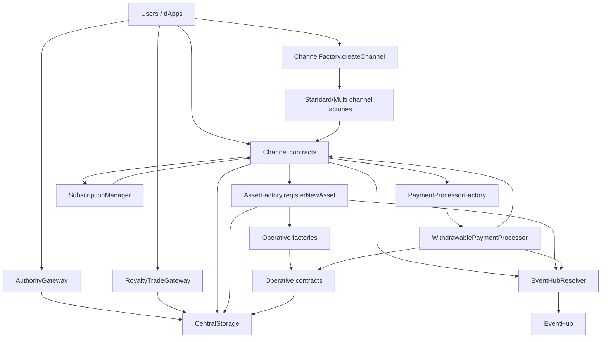

# Current Architecture and Contract Interactions

This page presents the current V3 architecture and how contracts interact at runtime.

## 1. High-Level Layers

- Entry and market layer:
  - `AuthorityGateway`
  - `RoyaltyTradeGateway`
  - `ChannelFactory`
- Core coordination:
  - `CentralStorage`
  - `SystemTracker`, `IPTracker`, `MarketplaceTracker`, `ChannelRegistry`, `FeesInformation`
- Asset and channel domain:
  - channel factories and channel instances (`DigitalAssetPublic`, `DigitalAssetPrivate`, `MultiChannel`)
  - `AssetFactory` and operative factories/instances
- Subscription domain:
  - `SubscriptionManager` + channel bridge module
- Event domain:
  - `EventHub` + `EventHubResolver`
- Payment domain:
  - `PaymentProcessorFactory` and `WithdrawablePaymentProcessor`

## 2. Interaction Graph

## 3. Primary Runtime Flows

### Channel creation

1. User calls `ChannelFactory.createChannel(...)`.
2. Factory routes to concrete channel factory by `(channelType, scope)`.
3. Concrete factory deploys/initializes beacon proxy channel.
4. Storage registration/acknowledgement is applied via `CentralStorage`/`SystemTracker`.

### Asset mint + protective flow

1. User mints in channel.
2. Channel delegates protective registration to `AssetFactory`.
3. `AssetFactory` routes operative deployment by `opType`.
4. `AssetFactory` registers operative mapping and binds content ID through tracker paths.
5. Optional access listing can be created via authority gateway flow.

### Access purchase

1. Seller lists access token through `AuthorityGateway.sellAccess`.
2. Buyer purchases via native/ERC-20 path through `buyAccess`.
3. Listing/accounting state is updated in marketplace tracking.
4. Payment routing and reward distribution go through payment processor logic.

### Royalty share trading

1. Holder lists token in `RoyaltyTradeGateway.sellToken`.
2. Buyer purchases or negotiates through offer lifecycle.
3. Restriction checks and payout logic run through trade/payment modules.

### Subscription purchase

1. User calls channel `subscribePlan(planId, args)` (SDK wrappers: `StandardChannel` or `MultiChannel`).
2. Channel delegates subscription state and validation to `SubscriptionManager`.
3. Manager calls back channel for mint/payment side-effects when required.
4. Access checks can resolve via subscription status in addition to operative ownership.

### Event emission

1. Domain contracts resolve EventHub using `EventHubResolver`.
2. Supported event classes are emitted via EventHub.
3. Missing mandatory hub configuration fails fast with `EventHubUnavailable`.

## 4. Architectural Differences vs Legacy

- Storage hub hardened and modernized (`CentralStorage`, constrained mutators).
- Channel and asset creation orchestration are explicit (`ChannelFactory`, `AssetFactory`).
- Subscription state no longer lives only inside channel contracts.
- Event pipeline is centralized for selected ecosystem event classes.
- Metadata and subscription ABI were simplified for indexer/wallet consistency.

## 5. Operational Invariants to Keep

- Deployment and upgrades should remain manifest-driven (`deployments/<chainid>.json`).
- EventHub acknowledgement must include runtime-created emitters.
- EIP-170 margin should be guarded in CI/preflight checks.
- ABI and event consumer updates should be validated with Foundry tests before release.
