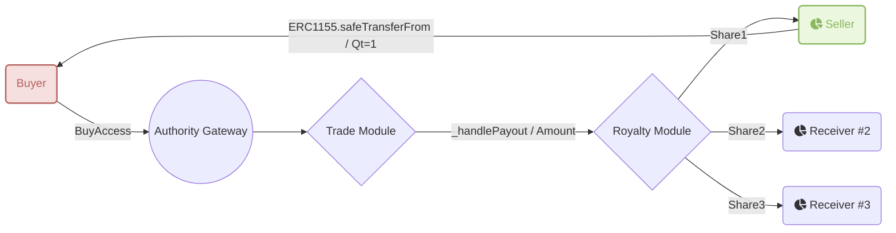

# AccessTradeModule
[Git Source](https://github.com/Elacity/v3-drm-protocol/blob/52ca0e7824ef5fab5ebe0a131f7c6e6dd330de09/contracts/modules/trade/AccessTradeModule.sol)

**Inherits:**
Initializable, [IAccessTradable](/contracts/modules/trade/IAccessTradable.md), [TradeFoundationModule](/contracts/modules/trade/TradeFoundationModule.md), [RoyaltyPayoutModule](/contracts/modules/royalty/RoyaltyPayoutModule.md)

This module is handling the workflow of sales and trades of the access token



## Functions
### __AccessTradeModule_init


```solidity
function __AccessTradeModule_init() internal onlyInitializing;
```

### _sellAccess

_sellAccess will sell an access token


```solidity
function _sellAccess(
    IStorage store,
    address seller,
    address ledger,
    uint256 tokenId,
    uint256 _quantity,
    uint256 _pricePerToken,
    address _payToken
) internal;
```
**Parameters**

|Name|Type|Description|
|----|----|-----------|
|`store`|`IStorage`|the storage contract|
|`seller`|`address`|the address of the seller|
|`ledger`|`address`|the address of the ledger|
|`tokenId`|`uint256`|the token id of the token|
|`_quantity`|`uint256`|the quantity of the token|
|`_pricePerToken`|`uint256`||
|`_payToken`|`address`||


### _buyAccess

_buyAccess will buy an access token from a seller


```solidity
function _buyAccess(
    IStorage store,
    address seller,
    address ledger,
    uint256 tokenId,
    uint256 _quantity,
    uint256 _pricePerToken,
    address _payToken
) internal;
```
**Parameters**

|Name|Type|Description|
|----|----|-----------|
|`store`|`IStorage`|the storage contract|
|`seller`|`address`|the address of the seller|
|`ledger`|`address`|the address of the ledger|
|`tokenId`|`uint256`|the token id of the token|
|`_quantity`|`uint256`|the quantity of the token|
|`_pricePerToken`|`uint256`||
|`_payToken`|`address`||


### _handlePayout

_handlePayout will handle the payout of a trade


```solidity
function _handlePayout(IStorage store, address _op, address seller, uint256 _amount, address _payToken) internal;
```
**Parameters**

|Name|Type|Description|
|----|----|-----------|
|`store`|`IStorage`|the storage contract|
|`_op`|`address`|the address of the operative|
|`seller`|`address`|the address of the seller|
|`_amount`|`uint256`|the amount of the trade|
|`_payToken`|`address`|the payment token of the trade|


### sellAccess

sellAccess will sell an access token


```solidity
function sellAccess(address ledger, uint256 tokenId, uint256 _quantity, uint256 _pricePerToken, address _payToken)
    external
    virtual;
```
**Parameters**

|Name|Type|Description|
|----|----|-----------|
|`ledger`|`address`|the address of the ledger|
|`tokenId`|`uint256`|the token id of the token|
|`_quantity`|`uint256`|the quantity of the token|
|`_pricePerToken`|`uint256`|the price per token of the token|
|`_payToken`|`address`|the payment token of the token|


### sellAccessOnBehalf

sellAccessOnBehalf will sell an access token on behalf of a seller


```solidity
function sellAccessOnBehalf(
    address seller,
    address ledger,
    uint256 tokenId,
    uint256 _quantity,
    uint256 _pricePerToken,
    address _payToken
) external virtual;
```
**Parameters**

|Name|Type|Description|
|----|----|-----------|
|`seller`|`address`|the address of the seller|
|`ledger`|`address`|the address of the ledger|
|`tokenId`|`uint256`|the token id of the token|
|`_quantity`|`uint256`|the quantity of the token|
|`_pricePerToken`|`uint256`|the price per token of the token|
|`_payToken`|`address`||


### withdrawListing

withdrawListing will withdraw an access token from sale


```solidity
function withdrawListing(address op, uint256 tokenId, uint256 quantity) external virtual;
```
**Parameters**

|Name|Type|Description|
|----|----|-----------|
|`op`|`address`|the address of the operative|
|`tokenId`|`uint256`|the token id of the token|
|`quantity`|`uint256`|the quantity of the token|


### buyAccess

buyAccess will buy an access token from a seller


```solidity
function buyAccess(address seller, address ledger, uint256 tokenId, uint256 _quantity, uint256 _pricePerToken)
    external
    payable
    virtual;
```
**Parameters**

|Name|Type|Description|
|----|----|-----------|
|`seller`|`address`|the address of the seller|
|`ledger`|`address`|the address of the ledger|
|`tokenId`|`uint256`|the token id of the token|
|`_quantity`|`uint256`|the quantity of the token|
|`_pricePerToken`|`uint256`|the price per token of the token|


### buyAccess

buyAccess will buy an access token from a seller


```solidity
function buyAccess(
    address seller,
    address ledger,
    uint256 tokenId,
    uint256 _quantity,
    uint256 _pricePerToken,
    address _payToken
) external virtual;
```
**Parameters**

|Name|Type|Description|
|----|----|-----------|
|`seller`|`address`|the address of the seller|
|`ledger`|`address`|the address of the ledger|
|`tokenId`|`uint256`|the token id of the token|
|`_quantity`|`uint256`|the quantity of the token|
|`_pricePerToken`|`uint256`|the price per token of the token|
|`_payToken`|`address`|the payment token of the token|


### listings

Get the listing details of a token


```solidity
function listings(address op, uint256 tokenId, address seller)
    external
    view
    virtual
    returns (uint256, uint256, address);
```
**Parameters**

|Name|Type|Description|
|----|----|-----------|
|`op`|`address`|the address of the operative|
|`tokenId`|`uint256`|the token id of the token|
|`seller`|`address`|the address of the seller|

**Returns**

|Name|Type|Description|
|----|----|-----------|
|`<none>`|`uint256`|the quantity of the token|
|`<none>`|`uint256`|the price per token of the token|
|`<none>`|`address`|the payment token of the token|


### sellersOf

Get the sellers of a token


```solidity
function sellersOf(address op, uint256 tokenId) external view virtual returns (address[] memory);
```
**Parameters**

|Name|Type|Description|
|----|----|-----------|
|`op`|`address`|the address of the operative|
|`tokenId`|`uint256`|the token id of the token|

**Returns**

|Name|Type|Description|
|----|----|-----------|
|`<none>`|`address[]`|the addresses of the sellers|


