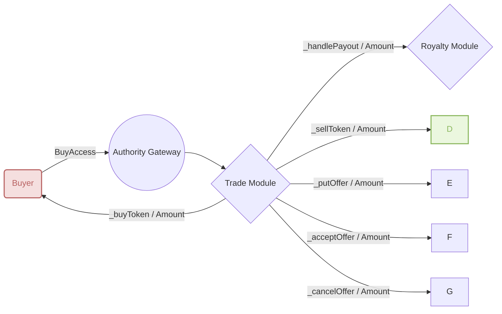

# TokenTradeModule
[Git Source](https://github.com/Elacity/v3-drm-protocol/blob/9e5d1dcd32c5761e2bd56d37138c1de7aac83865/contracts/modules/trade/TokenTradeModule.sol)

**Inherits:**
Initializable, [ITokenTradable](/contracts/modules/trade/ITokenTradable.md), [ITokenOfferable](/contracts/modules/trade/ITokenOfferable.md), [TradeFoundationModule](/contracts/modules/trade/TradeFoundationModule.md), [PaymentModule](/contracts/modules/payment/PaymentModule.md)

**Title:**
TokenTradeModule

This module is handling the workflow of sales and trades of the token



## Functions
### __TokenTradeModule_init


```solidity
function __TokenTradeModule_init() internal onlyInitializing;
```

### _handlePayout

_handlePayout will handle the payout of a trade


```solidity
function _handlePayout(IStorage store, address from, address to, uint256 _amount, address _payToken) internal;
```
**Parameters**

|Name|Type|Description|
|----|----|-----------|
|`store`|`IStorage`|the storage contract|
|`from`|`address`|the address of the payer|
|`to`|`address`|the address of the receiver|
|`_amount`|`uint256`|the amount of the trade|
|`_payToken`|`address`|the payment token of the trade|


### withdrawListing

withdrawListing will withdraw a token from sale


```solidity
function withdrawListing(address op, uint256 tkId, uint256 quantity) external virtual;
```
**Parameters**

|Name|Type|Description|
|----|----|-----------|
|`op`|`address`|the address of the operative|
|`tkId`|`uint256`|the token id of the token|
|`quantity`|`uint256`|the quantity of the token|


### sellToken

sellToken will sell a token and place it on sale


```solidity
function sellToken(address _contract, uint256 tokenId, uint256 _quantity, uint256 _pricePerToken, address _payToken)
    external
    virtual;
```
**Parameters**

|Name|Type|Description|
|----|----|-----------|
|`_contract`|`address`|the contract address of the token|
|`tokenId`|`uint256`|the token id of the token|
|`_quantity`|`uint256`|the quantity of the token|
|`_pricePerToken`|`uint256`|the price per token of the token|
|`_payToken`|`address`|the payment token of the token|


### _buyToken

_buyToken will buy a token from a seller


```solidity
function _buyToken(
    IStorage store,
    address seller,
    address _contract,
    uint256 tkId,
    uint256 _quantity,
    uint256 _pricePerToken,
    address _payToken
) internal;
```
**Parameters**

|Name|Type|Description|
|----|----|-----------|
|`store`|`IStorage`|the storage contract|
|`seller`|`address`|the address of the seller|
|`_contract`|`address`|the contract address of the token|
|`tkId`|`uint256`|the token id of the token|
|`_quantity`|`uint256`|the quantity of the token|
|`_pricePerToken`|`uint256`|the price per token of the token|
|`_payToken`|`address`|the payment token of the token|


### buyToken

buyToken will buy a token from a seller


```solidity
function buyToken(address seller, address _contract, uint256 tokenId, uint256 _quantity) external payable virtual;
```
**Parameters**

|Name|Type|Description|
|----|----|-----------|
|`seller`|`address`|the address of the seller|
|`_contract`|`address`|the contract address of the token|
|`tokenId`|`uint256`|the token id of the token|
|`_quantity`|`uint256`|the quantity of the token|


### _putOffer

_putOffer is in charge of settle offer details in the storage


```solidity
function _putOffer(
    IStorage store,
    address putBy,
    address _contract,
    uint256 tokenId,
    uint256 _quantity,
    uint256 _pricePerToken,
    address payToken,
    bool isAcceptance
) internal;
```
**Parameters**

|Name|Type|Description|
|----|----|-----------|
|`store`|`IStorage`|the storage contract|
|`putBy`|`address`|the address of the offer creator|
|`_contract`|`address`|the contract address of the offer|
|`tokenId`|`uint256`|the token id of the offer|
|`_quantity`|`uint256`|the quantity of the offer|
|`_pricePerToken`|`uint256`|the price per token of the offer|
|`payToken`|`address`|the payment token of the offer|
|`isAcceptance`|`bool`|whether the offer is accepted|


### createOffer

createOffer creates an offer with ERC-20 token


```solidity
function createOffer(
    address _contract,
    uint256 tokenId,
    uint256 _quantity,
    uint256 _pricePerToken,
    address payToken
) external virtual;
```
**Parameters**

|Name|Type|Description|
|----|----|-----------|
|`_contract`|`address`|the contract address of the offer|
|`tokenId`|`uint256`|the token id of the offer|
|`_quantity`|`uint256`|the quantity of the offer|
|`_pricePerToken`|`uint256`|the price per token of the offer|
|`payToken`|`address`||


### createOffer

createOffer creates an offer with native token (ETH)


```solidity
function createOffer(address _contract, uint256 tokenId, uint256 _quantity, uint256 _pricePerToken)
    external
    payable
    virtual;
```
**Parameters**

|Name|Type|Description|
|----|----|-----------|
|`_contract`|`address`|the contract address of the offer|
|`tokenId`|`uint256`|the token id of the offer|
|`_quantity`|`uint256`|the quantity of the offer|
|`_pricePerToken`|`uint256`|the price per token of the offer|


### _acceptOffer

_acceptOffer will accept an offer made by a buyer


```solidity
function _acceptOffer(IStorage store, address offerBy, address _contract, uint256 tokenId, uint256 _quantity)
    internal;
```
**Parameters**

|Name|Type|Description|
|----|----|-----------|
|`store`|`IStorage`|the storage contract|
|`offerBy`|`address`|the address of the offer creator|
|`_contract`|`address`|the contract address of the offer|
|`tokenId`|`uint256`|the token id of the offer|
|`_quantity`|`uint256`|the quantity of the offer|


### acceptOffer

acceptOffer will accept an offer made by a buyer


```solidity
function acceptOffer(address from, address _contract, uint256 tokenId, uint256 _quantity) external virtual;
```
**Parameters**

|Name|Type|Description|
|----|----|-----------|
|`from`|`address`|the address of the offer creator|
|`_contract`|`address`|the contract address of the offer|
|`tokenId`|`uint256`|the token id of the offer|
|`_quantity`|`uint256`|the quantity of the offer|


### cancelOffer

cancelOffer will withdraw an offer made by its creator


```solidity
function cancelOffer(address _contract, uint256 tokenId) external virtual;
```
**Parameters**

|Name|Type|Description|
|----|----|-----------|
|`_contract`|`address`|the contract address of the offer|
|`tokenId`|`uint256`|the token id of the offer|


