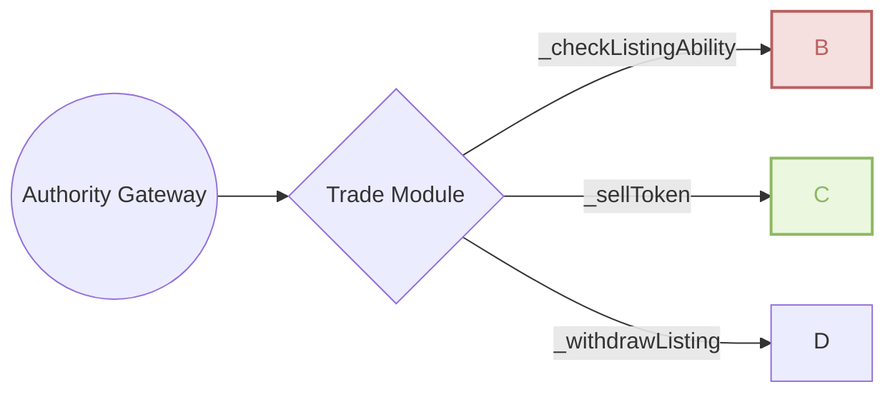

# TradeFoundationModule
[Git Source](https://github.com/Elacity/v3-drm-protocol/blob/674fb60a18e2aa14b7080f0f43e11002723bd5b3/contracts/modules/trade/TradeFoundationModule.sol)

**Inherits:**
Initializable, ContextUpgradeable, [ITradableErrors](../../modules/trade/ITradableErrors.md), [ITradableEvents](../../modules/trade/ITradableEvents.md)

**Title:**
TradeFoundationModule

This module is handling the foundation of trade operations



## Functions
### __TradeFoundationModule_init


```solidity
function __TradeFoundationModule_init() internal onlyInitializing;
```

### _checkListingAbility

_checkListingAbility will check if the owner has the ability to sell a token


```solidity
function _checkListingAbility(address owner, address _contractAddr, uint256 tkId, uint256 _quantity) internal view;
```
**Parameters**

|Name|Type|Description|
|----|----|-----------|
|`owner`|`address`|the address of the owner|
|`_contractAddr`|`address`|the address of the contract|
|`tkId`|`uint256`|the token id of the token|
|`_quantity`|`uint256`|the quantity of the token|


### _sellToken

_sellToken will sell a token and place it on sale


```solidity
function _sellToken(
    IStorage store,
    address seller,
    address _opAddr,
    uint256 tokenId,
    uint256 _quantity,
    uint256 _pricePerToken,
    address _payToken
) internal;
```
**Parameters**

|Name|Type|Description|
|----|----|-----------|
|`store`|`IStorage`|the storage contract|
|`seller`|`address`|the address of the seller|
|`_opAddr`|`address`|the address of the operative|
|`tokenId`|`uint256`|the token id of the token|
|`_quantity`|`uint256`|the quantity of the token|
|`_pricePerToken`|`uint256`||
|`_payToken`|`address`||


### _withdrawListing

_withdrawListing will withdraw a token from sale


```solidity
function _withdrawListing(IStorage store, address seller, address op, uint256 tkId, uint256 quantity) internal;
```
**Parameters**

|Name|Type|Description|
|----|----|-----------|
|`store`|`IStorage`|the storage contract|
|`seller`|`address`|the address of the seller|
|`op`|`address`|the address of the operative|
|`tkId`|`uint256`|the token id of the token|
|`quantity`|`uint256`|the quantity of the token|


### _emitItemSold

Emits item sold event for trade settlement.


```solidity
function _emitItemSold(
    IStorage store,
    address seller,
    address buyer,
    address op,
    uint256 tkId,
    address payToken,
    uint256 unitPrice,
    uint256 price
) internal;
```
**Parameters**

|Name|Type|Description|
|----|----|-----------|
|`store`|`IStorage`|Ecosystem storage contract.|
|`seller`|`address`|Seller address.|
|`buyer`|`address`|Buyer address.|
|`op`|`address`|Operative/token contract.|
|`tkId`|`uint256`|Token identifier sold.|
|`payToken`|`address`|Payment token used in sale.|
|`unitPrice`|`uint256`|Unit price for the sale.|
|`price`|`uint256`|Total sale price.|


