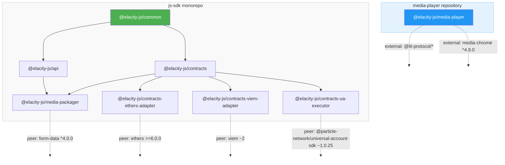

# Versioning & Release Standard

This document describes the versioning policy, release process, and commit conventions adopted by the `@elacity-js` SDK monorepo.

## Overview

| Aspect | Standard |
|--------|----------|
| Versioning scheme | [Semantic Versioning 2.0.0](https://semver.org/) |
| Versioning strategy | **Independent** — each package has its own version lifecycle |
| Commit convention | [Conventional Commits](https://www.conventionalcommits.org/) |
| Tooling | [Nx Release](https://nx.dev/features/manage-releases) + pnpm workspaces |
| npm authentication | [Trusted Publishers (OIDC)](https://docs.npmjs.com/trusted-publishers) |

## Semantic Versioning

All packages follow [SemVer](https://semver.org/):

```
MAJOR.MINOR.PATCH[-prerelease]

Examples:
  1.0.0          — stable release
  1.2.0-beta.3   — pre-release (beta channel)
  0.8.4-beta.20  — pre-release during initial development
```

**Version meaning:**

| Bump | When | Example |
|------|------|---------|
| `MAJOR` | Breaking API changes | Removing a public method, changing a return type |
| `MINOR` | New features (backwards-compatible) | Adding a new service method, new export |
| `PATCH` | Bug fixes (backwards-compatible) | Fixing an incorrect calculation, typo in output |

### Pre-release Versions

During the current beta phase, all packages carry a `-beta.N` suffix. Pre-release versions are published to npm under the **`beta` dist-tag**, meaning:

```bash
# Installs the latest STABLE version (when available)
npm install @elacity-js/common

# Installs the latest beta explicitly
npm install @elacity-js/common@beta
```

This ensures consumers who run `npm install` without a tag are never silently upgraded to an unstable version.

## Independent Package Versioning

Each package in the monorepo is versioned **independently**. A commit that only affects `@elacity-js/api` will only bump that package — other packages remain untouched.

This means:
- Different packages can be at completely different versions (e.g., `common@1.0.0`, `api@0.8.4`)
- A release only publishes packages that actually changed
- If no packages changed, the release pipeline succeeds without publishing anything

### What triggers a version bump

Version bumps are determined automatically from **conventional commit messages** that touch files within a package's directory:

| Commit type | Version bump |
|-------------|-------------|
| `fix:` | `PATCH` |
| `feat:` | `MINOR` |
| `feat!:` or `BREAKING CHANGE:` footer | `MAJOR` |
| `docs:`, `ci:`, `chore:`, `style:`, `test:` | No bump |

### Internal dependency resolution

Packages reference each other using pnpm's `workspace:*` protocol:

```json
{
  "dependencies": {
    "@elacity-js/common": "workspace:*"
  }
}
```

At publish time, pnpm automatically replaces `workspace:*` with the actual version number of the dependency.

## Commit Convention

All commits **must** follow the [Conventional Commits](https://www.conventionalcommits.org/) specification. This is enforced locally via `commitlint` + `husky` git hooks.

### Format

```
type(scope): subject

[optional body]

[optional footer(s)]
```

### Allowed types

| Type | Purpose |
|------|---------|
| `feat` | New feature |
| `fix` | Bug fix |
| `docs` | Documentation only |
| `style` | Formatting, whitespace (no logic change) |
| `refactor` | Code restructuring (no feature or fix) |
| `perf` | Performance improvement |
| `test` | Adding or updating tests |
| `build` | Build system or external dependencies |
| `ci` | CI configuration |
| `chore` | Maintenance tasks |
| `revert` | Reverting a previous commit |

### Scope

The scope is **optional** but recommended when a commit targets a specific package:

```bash
# Good — scoped to a package
feat(api): add batch request support
fix(contracts): handle zero-address edge case

# Good — repo-wide change
ci: add commitlint enforcement
docs: update versioning wiki

# Bad — vague
fix: stuff
```

### Breaking changes

Breaking changes must be indicated by either:

1. An exclamation mark after the type: `feat!: remove deprecated endpoint`
2. A `BREAKING CHANGE:` footer in the commit body:

```
feat(api): redesign authentication flow

BREAKING CHANGE: The `authenticate()` method now returns a Promise<Session>
instead of a Session object. All callers must be updated to await the result.
```

## Changelogs

The repository maintains **two levels** of changelogs:

### Global changelog (`CHANGELOG.md` at repo root)

Contains a consolidated view of all changes across the entire monorepo, grouped by release date. Useful for getting a high-level overview of what changed in each release cycle.

### Per-package changelogs (`packages/<name>/CHANGELOG.md`)

Each package has its own changelog that **only includes changes relevant to that specific package**. If a commit doesn't touch a package's code, it won't appear in that package's changelog.

Both changelogs are generated automatically from conventional commit messages by Nx Release. They follow the [Keep a Changelog](https://keepachangelog.com/) format.

## Release Pipeline

Releases are fully automated via GitHub Actions on every push to `main`.

### Flow

```
push to main
    │
    ▼
┌─────────────────────────────┐
│  1. Build all packages      │
│  2. Detect version changes  │──── No changes? ──→ Pipeline succeeds (exit 0)
│     (dry-run)               │                     Demo deploy proceeds
└────────────┬────────────────┘
             │ Changes detected
             ▼
┌─────────────────────────────┐
│  3. Bump versions           │
│  4. Generate changelogs     │
│  5. Create git tags         │
│  6. Push commits + tags     │
│  7. Create GitHub Releases  │
└────────────┬────────────────┘
             │
             ▼
┌─────────────────────────────┐
│  8. Publish to npm          │
│     (with correct dist-tag) │
└────────────┬────────────────┘
             │
             ▼
┌─────────────────────────────┐
│  9. Deploy demo apps        │
│     (triggered on success)  │
└─────────────────────────────┘
```

### Key behaviors

- **No changes = no release**: If no conventional commits affect any package since the last release, the pipeline exits successfully without publishing. The demo deployment still proceeds.
- **Only changed packages are published**: A commit affecting `@elacity-js/api` only bumps and publishes `api` — all other packages are untouched.
- **Git tags**: Created automatically per-package with pattern `@elacity-js/<name>@<version>`.
- **GitHub Releases**: Created automatically for each bumped package.
- **dist-tag**: Pre-release versions are published under `beta`, stable versions under `latest`.

### npm authentication

Publishing uses [npm Trusted Publishers (OIDC)](https://docs.npmjs.com/trusted-publishers) — no npm tokens are stored as secrets. GitHub Actions authenticates directly with npm via OpenID Connect.

## Git Tag Convention

Tags follow the standard npm ecosystem convention:

```
{package-name}@{version}

Examples:
  @elacity-js/common@1.0.0-beta.21
  @elacity-js/api@0.8.5
  @elacity-js/contracts@1.0.0
```

This format is recognized by most monorepo tooling (Nx, Lerna, Changesets) and makes it easy to filter tags by package:

```bash
# List all releases for a specific package
git tag --list '@elacity-js/api@*'
```

## Package Dependency Graph



### Packages detail

| Package | Repository | Internal Dependencies | Key External Dependencies | Layer |
|---------|-----------|----------------------|--------------------------|-------|
| `@elacity-js/common` | js-sdk | — | — | Foundation |
| `@elacity-js/api` | js-sdk | `common` | — | Core |
| `@elacity-js/contracts` | js-sdk | `common` | — | Core |
| `@elacity-js/contracts-ethers-adapter` | js-sdk | `contracts` | peer: `ethers >=6.0.0` | Adapter |
| `@elacity-js/contracts-viem-adapter` | js-sdk | `contracts` | peer: `viem ~2` | Adapter |
| `@elacity-js/contracts-ua-executor` | js-sdk | `contracts` | peer: `@particle-network/universal-account-sdk ~1.0.25` | Adapter |
| `@elacity-js/media-packager` | js-sdk | `api`, `contracts` | peer: `form-data ^4.0.0` | Composite |
| `@elacity-js/media-player` | [media-player](https://github.com/elacity/media-player) | — | `@lit-protocol/*`, `media-chrome` | Standalone |

### Dependency layers

The packages are organized into three layers:

- **Foundation** — `common` has no internal dependencies and is the base for all other packages. A breaking change here cascades to the entire SDK.
- **Core** — `api` and `contracts` depend only on `common`. They provide the primary SDK functionality.
- **Adapter / Composite** — These packages sit at the edge of the dependency graph. Adapters wrap `contracts` for a specific provider library (ethers, viem, Particle). `media-packager` composes both `api` and `contracts` for media upload workflows.
- **Standalone** — `@elacity-js/media-player` (see below).

### `@elacity-js/media-player` (separate repository)

The media player is published under the `@elacity-js` scope but lives in its own repository ([elacity/media-player](https://github.com/elacity/media-player)). It is a WebAssembly-based player for DRM-protected MPEG-DASH streams and has **no dependency on the js-sdk packages**.

Key differences from js-sdk packages:

| Aspect | js-sdk packages | media-player |
|--------|----------------|--------------|
| Repository | `elacity/js-sdk` (monorepo) | `elacity/media-player` (standalone) |
| Build system | Nx + tsc | Rollup + Emscripten (C → WASM) |
| Module format | CommonJS | ES Module |
| Versioning | Independent via Nx Release | Manual (currently `0.9.0`) |
| Runtime | Node.js / browser | Browser only (requires MSE + SharedArrayBuffer) |

Because the media player has no internal dependency on the js-sdk, its release cycle is fully independent. Version bumps in js-sdk packages do not affect `@elacity-js/media-player` and vice versa.

### Version cascade implications

Because packages are versioned independently, a change in an upstream package does **not** automatically bump downstream packages. However:

- A **breaking change** in `common` should be coordinated with bumps in `api`, `contracts`, and transitively all adapters.
- A **breaking change** in `contracts` should be coordinated with bumps in the three adapter packages and `media-packager`.
- Adapter packages can be bumped independently since they have no downstream dependents.
- `@elacity-js/media-player` is unaffected by any js-sdk changes — it is versioned and released separately.
